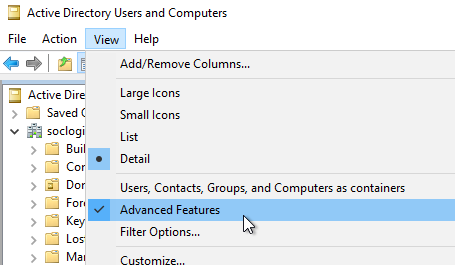
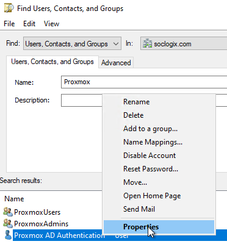
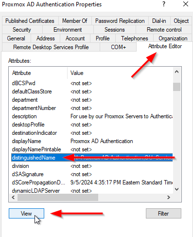
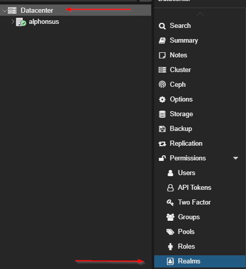
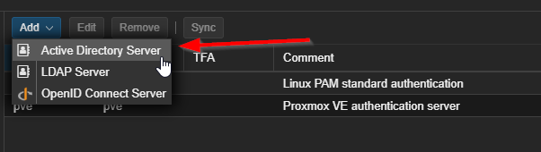
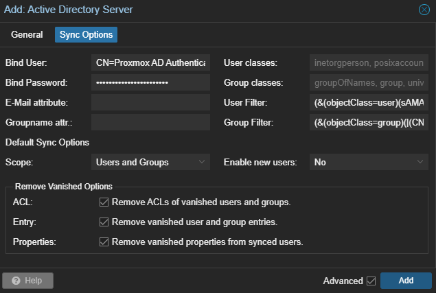
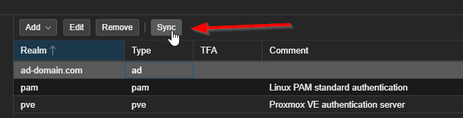
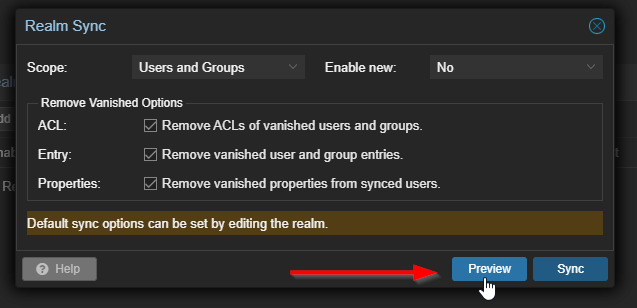

# Proxmox VE Active Directory Authentication and Integration Guide

This guide documents the SOClogix-standard approach for integrating Proxmox VE with Microsoft Active Directory (AD) for centralized authentication and authorization. It covers configuring the Active Directory Authentication Realm in Proxmox and joining the Proxmox host to the AD domain.

The recommended approach is to configure the AD Authentication Realm first, validate authentication using plain LDAP, enable STARTTLS as soon as certificate requirements are met, and then join the Proxmox host to the domain for full OS-level integration.

---

## Section 1: Configure the Active Directory Authentication Realm

### Prerequisites

Before configuring the AD realm in Proxmox, ensure the following prerequisites are met:

- Proxmox VE hostname is fully qualified (FQDN)
- DNS resolution points exclusively to Active Directory Domain Controllers
- System time and timezone are correct and synchronized with the domain
- Network connectivity to Domain Controllers on TCP port 389 (LDAP)

---

### Domain Controller Preparation

#### Create a Service Account for Proxmox LDAP Binding

Create a dedicated Active Directory user account to be used as the LDAP bind user for Proxmox authentication.

Recommendations:

- Use a clearly named service account (for example: proxmox_auth)
- Default domain user permissions are sufficient (read-only access)
- Password policy:
  - A non-expiring password is recommended to prevent authentication outages
  - If expiring passwords are required, rotation procedures must be documented and followed
- Deny interactive logon where feasible

The distinguishedName of this account will be required when configuring the Proxmox realm.

---

#### Obtain the Distinguished Name of the Service Account

From Active Directory Users and Computers:

- Enable Advanced Features
- Open the service account properties
- Locate and copy the distinguishedName attribute







Example distinguishedName format:

CN=proxmox_auth,OU=Service Accounts,DC=example,DC=com

---

#### Create Standard Active Directory Groups

Create the following Active Directory security groups:

- ProxmoxAdmins
- ProxmoxUsers

Recommendations:

- Use Global Security Groups
- Place groups in a dedicated organizational unit
- Manage Proxmox authorization exclusively through group membership

Record the distinguishedName for each group for later use in LDAP filters.

Example group distinguishedNames:

CN=ProxmoxAdmins,OU=Proxmox Groups,DC=example,DC=com  
CN=ProxmoxUsers,OU=Proxmox Groups,DC=example,DC=com

---

### Add the Active Directory Realm in Proxmox and Configure General settings

In the Proxmox Web UI, navigate to:

Datacenter → Permissions → Realms → Add → Active Directory Server





Configure the realm with the following values:

- Realm: This will be a name/ID. Just put the AD domain.
- Domain: Put the AD domain here. i.e. example.com
- Default: Check the box to make this the default realm when accessing the Web GUI.
- Server: Put either the Domain Controller IP or FQDN
- Fallback Server: Add the IP or FQDN of another Domain Controller to use as a fallback.
- Port: Leave as default unless otherwise required.
- Mode: If Domain Controllers are confirmed to have valid LDAP certificates and the issuing Certificate Authority is trusted by the Proxmox host, configure the Active Directory realm to use **STARTTLS** immediately; otherwise, use plain LDAP temporarily for initial validation and transition to STARTTLS as soon as certificate requirements are met.
- Verify Certificate: Leave unchecked for now. When STARTTLS is enabled with certificate verification disabled, Proxmox encrypts LDAP traffic but does not validate the Domain Controller’s certificate. This mode is suitable for initial deployment or transitional environments and should be upgraded to verified STARTTLS once a trusted certificate authority is available.
- Comment: This field functions as a human-readable display name for the realm and is shown on the Proxmox Web UI login screen; if left unset, the Realm ID is displayed instead.


---

### Configure Sync Options to include User and Group Filters

Configure LDAP filters to restrict which users and groups are synchronized into Proxmox.

- Bind User: Distinguished name of the service account
- Password: Service account password
- Scope: Set to Users and Groups.
- Enable new users: Set to No as a precaution, otherwise leave set to the default Yes. If no, then all newly added users will need to be manually enabled and will be unable to logon until enabled.
- Removed Vanished Options: Enable all three settings.
- User Filter:  
Use this LDAP filter to restrict which Active Directory user accounts are synchronized into Proxmox.  
This example limits synchronization to user objects that are members of either the `ProxmoxAdmins` or `ProxmoxUsers` groups.  
Update the group names, organizational units, and domain components to match your Active Directory structure using the correct distinguishedName values.
    > Example:  
```
(&(objectClass=user)(|(memberOf=CN=ProxmoxAdmins,OU=Proxmox Groups,DC=example,DC=com)(memberOf=CN=ProxmoxUsers,OU=Proxmox Groups,DC=example,DC=com)))
```
- Group Filter:  
Use this LDAP filter to control which Active Directory groups are synchronized into Proxmox.  
This example restricts group synchronization to the `ProxmoxAdmins` and `ProxmoxUsers` groups only.  
Modify the group names as needed to align with your standard Proxmox authorization groups.
    > Example:  
```
(&(objectClass=group)(|(CN=ProxmoxAdmins)(CN=ProxmoxUsers)))
```


Select Add when done with configuring General and Sync Options.

---

### Initial Validation Using Plain LDAP

For initial testing and validation:

- Conduct a **Preview Sync** test run for the Active Directory realm to verify connectivity and LDAP query results without making changes.





Verify that:
- Expected users are returned by the preview
- Expected groups are returned by the preview
- No LDAP errors are reported
- Authentication works via the Proxmox login screen after completing a full sync

---

### Active Directory Certificate Services (AD CS) Requirements for STARTTLS

Using STARTTLS for Active Directory authentication requires Domain Controllers to present valid TLS certificates for LDAP.   
While STARTTLS does not mandate a specific certificate authority, a properly deployed and managed certificate infrastructure is required for reliable and secure operation.

Active Directory Certificate Services (AD CS) is the recommended and standard solution for issuing and managing LDAP certificates for Domain Controllers.

#### Why AD CS Is Recommended

AD CS provides:

- Automatic certificate enrollment for Domain Controllers
- Correct certificate usage and extensions by default
- Consistent trust across all domain-joined systems
- Automatic certificate renewal
- Reduced operational and troubleshooting overhead

Without AD CS, certificates must be manually issued, installed, and renewed on each Domain Controller, which significantly increases operational risk.

See: [Install the Certification Authority on Windows Server](https://learn.microsoft.com/en-us/windows-server/networking/core-network-guide/cncg/server-certs/install-the-certification-authority)

---

#### Certificate Requirements on Domain Controllers

Each Domain Controller must have **at least one** certificate suitable for LDAP and Kerberos operations.   
The certificate used by Active Directory must:

- Be issued by a **trusted Certificate Authority**
- Include the **Server Authentication** enhanced key usage
- Contain the Domain Controller’s hostname in the **Common Name (CN)** or **Subject Alternative Name (SAN)**
- Be **valid** (not expired or revoked)

When an appropriate certificate is present, Active Directory will automatically enable TLS for LDAP, including support for **LDAP STARTTLS** (TCP 389) and **LDAPS** (TCP 636).

These certificates are presented by Domain Controllers during LDAP STARTTLS negotiations and are required for secure, encrypted LDAP authentication.

---

#### AD CS Deployment Recommendations

Deploying **Active Directory Certificate Services (AD CS)** as an **Enterprise Certificate Authority** is the recommended and supported method for issuing LDAP-capable certificates to Domain Controllers.

When AD CS is deployed using **default Microsoft settings**:

- Domain Controllers are **hard-coded to auto-enroll** for certificates
- No manual Group Policy changes are typically required
- Certificates are automatically issued, installed, and renewed
- Default certificate templates are published and used automatically

In a standard deployment, Domain Controllers will successfully obtain and maintain certificates without administrator intervention.

---

##### Certificate Templates

By default, AD CS provides several templates that are eligible for Domain Controller enrollment:

- **Domain Controller** (legacy)
- **Domain Controller Authentication**
- **Directory Email Replication** (obsolete)
- **Kerberos Authentication** (preferred and modern)

Microsoft recommends using the **Kerberos Authentication** template going forward, as it supports modern authentication methods and includes the necessary extensions for securing LDAP traffic.

To avoid ambiguity and unintended behavior:

- Only **one** certificate template should be available for Domain Controller auto-enrollment
- Older or superseded templates should be removed or unpublished if not required
- Custom templates must explicitly allow Domain Controllers to auto-enroll

Multiple eligible templates can result in Domain Controllers enrolling for **multiple certificates**, which may cause Active Directory to bind to an unintended certificate at startup.

---

##### Auto-Enrollment Behavior

In default Active Directory environments, when an Enterprise Certificate Authority is deployed using standard Microsoft settings:

- Domain Controllers automatically enroll and renew certificates without additional configuration
- Auto-renewal occurs prior to certificate expiration
- Certificates are placed in the local machine personal certificate store
- The **legacy “Domain Controller” certificate template is commonly used** for auto-enrollment unless newer templates are explicitly configured or older templates are removed

This behavior is expected and fully supported by Microsoft.

Explicitly enabling certificate auto-enrollment via Group Policy or modifying certificate templates is only required if:

- Auto-enrollment has been explicitly disabled
- Custom or non-default certificate templates are required
- Multiple certificate templates are published for Domain Controller use
- The environment has been intentionally hardened or customized beyond default Microsoft behavior

---
##### Operational Guidance

- No manual certificate installation should be required on Domain Controllers in a default AD CS deployment
- Certificate lifecycle management should remain automated wherever possible
- Any deviation from default templates or enrollment behavior must be planned, tested, and documented

If an organization chooses to migrate Domain Controllers to the newer **Kerberos Authentication** certificate template (recommended for modern environments):

- Ensure only **one** certificate template is eligible for Domain Controller auto-enrollment
- Unpublish or remove older Domain Controller–related templates to prevent multiple certificate issuance
- Verify the Kerberos Authentication template:
  - Includes Server Authentication
  - Allows auto-enrollment for Domain Controllers
  - Is published by the issuing Enterprise CA
- Allow Domain Controllers to auto-enroll and renew certificates using the new template
- Remove superseded certificates only after successful enrollment and validation

Template migration should be performed deliberately, as multiple eligible templates can result in Domain Controllers enrolling for multiple certificates and binding to an unintended certificate at startup.

A properly deployed Enterprise CA with disciplined template hygiene ensures Domain Controllers consistently maintain valid certificates suitable for LDAP STARTTLS and other secure Active Directory operations.

See: [Consolidating Windows Active Directory Domain Controller Certificates](https://techcommunity.microsoft.com/blog/askds/consolidating-windows-active-directory-domain-controller-certificates/4180372)  

---

#### Proxmox Trust Requirements

The Proxmox VE host must trust the Certificate Authority (CA) that issued the Domain Controller LDAP certificates in order for STARTTLS with certificate verification to succeed.

##### Export CA Certificates from AD CS

From a Domain Controller or Certificate Authority server:

- Identify the **root CA** and any **intermediate CAs** that issued certificates to the Domain Controllers
- Export each CA certificate in **Base-64 encoded X.509 (.cer)** format
- Ensure you have the full certificate chain (root and intermediates, if applicable)

See: [Zscalar - Exporting a Root CA Certificate from an Active Directory Certificate Service](https://help.zscaler.com/deception/exporting-root-ca-certificate-active-directory-certificate-service)  

At the above resource follow the instructions under the 'Creating a Certificate Snap-in' and 'Exporting a CA Certificate' sections and ignore Zscaler Deception Admin Portal specific items.

---

##### Transfer CA Certificates to the Proxmox Host

After exporting the required root and intermediate CA certificates from AD CS, transfer the certificate files to the Proxmox VE host using a secure method.

Recommended transfer methods include:

- Secure copy (SCP or SFTP)
- Secure file transfer over an internal management network
- Temporary placement on a secured administrative workstation followed by transfer

Ensure that:

- Certificate files remain unmodified during transfer
- Files are not exposed on publicly accessible systems
- Access to the certificate files is limited to administrators

Once transferred, proceed with installing the CA certificates into the Proxmox system trust store.

---

##### Install CA Certificates on the Proxmox Host

On the Proxmox VE host:

- Copy the exported CA certificate files to:
  `/usr/local/share/ca-certificates/`
- Ensure files use the `.crt` extension
> Example
```
cp /usr/local/share/ca-certificates/soclogix-root-ca-12172025.cer /usr/local/share/ca-certificates/soclogix-root-ca-12172025.crt
```
- Update the system trust store by running:
```
update-ca-certificates
```
This process installs the CA certificates into the Debian system trust store used by Proxmox.

---

##### Validate Certificate Trust

Before enabling STARTTLS certificate verification in Proxmox, explicitly validate that the Proxmox host can establish and verify a trusted LDAP STARTTLS connection to a Domain Controller.

From the Proxmox VE host, run:
```
openssl s_client -connect dc01.example.com:389 -starttls ldap
```
Replace `dc01.example.com` with the fully qualified domain name of a Domain Controller.

Review the output and confirm the following:

- The TLS handshake completes without errors
- The certificate presented by the Domain Controller chains back to the expected issuing CA
- The final verification result is successful

A successful validation will end with output similar to:

Verify return code: 0 (ok)

If the output is lengthy or difficult to parse, you can filter for the verification result using:
```
openssl s_client -connect dc01.example.com:389 -starttls ldap | grep Verify
```

This indicates that:
- STARTTLS negotiation succeeded
- The Domain Controller certificate is trusted
- The certificate chain is complete
- The hostname matches the certificate

Common failure examples include:

Verify return code: 20 (unable to get local issuer certificate)  
Indicates a missing or untrusted CA certificate on the Proxmox host.

Verify return code: 62 (hostname mismatch)  
Indicates the Domain Controller hostname used does not match the certificate CN or SAN.

Verify return code: 10 (certificate has expired)  
Indicates an expired Domain Controller or CA certificate.

Successful validation confirms that the Proxmox host trusts the issuing Certificate Authority and that STARTTLS with certificate verification can be safely enabled in the Proxmox realm configuration.

---

##### Enable STARTTLS with Verification

After CA trust has been validated:

- Edit the Active Directory realm in Proxmox
- Set TLS Mode to **STARTTLS**
- Enable **Verify Certificate**
- Ensure the Server and Fallback Server are set using **FQDN** and not IP.

If the issuing CA is not trusted or the certificate chain is incomplete, STARTTLS authentication will fail immediately, which indicates a certificate or trust configuration issue that must be corrected before proceeding.

---

#### Operational Guidance

- STARTTLS should not be enabled until AD CS is deployed and verified
- Certificate lifecycle management should be owned by the Active Directory team or organizational equivalent
- Certificate expiration monitoring should be in place for Domain Controllers
- STARTTLS must use TCP port 389; LDAPS on port 636 is not required when STARTTLS is used

---

### Enable STARTTLS

After verifying basic functionality and ensuring Domain Controllers present valid LDAP TLS certificates:

- Edit the Active Directory realm
- Set TLS Mode to STARTTLS
- Enable certificate verification
- Ensure the issuing CA is trusted on the Proxmox host

STARTTLS should be enabled as soon as possible to protect credentials in transit.

---

### Proxmox Login Testing

Log out of the Proxmox Web UI and authenticate using:

- The Active Directory realm from the login dropdown
- The AD username should be input without the domain

Notes:

- Active Directory users can authenticate to the Proxmox Web UI
- Shell access remains restricted to local accounts unless explicitly configured

---

## Domain Join Considerations (Post–Section 1, Pre–Section 2)

After configuring and validating the Active Directory Authentication Realm in Proxmox VE, it is important to determine whether the Proxmox host should also be joined to the Active Directory domain. Domain-joining is **not a mandatory step** for Proxmox AD authentication and should be treated as an **intentional design decision**, not a default action.

---

### What Is Already Achieved with an AD Authentication Realm

When an Active Directory realm is configured in Proxmox VE (preferably with STARTTLS):

- Authentication to the Proxmox Web UI is centralized in Active Directory
- Authorization is managed via AD group membership (for example, ProxmoxAdmins and ProxmoxUsers)
- Credentials are transmitted securely when LDAP encryption is enabled using STARTTLS (preferred) or LDAPS
- Proxmox access control is decoupled from local Linux accounts
- The Proxmox host remains operational even if domain services are temporarily unavailable

For many environments, this provides all required functionality for secure and manageable access to Proxmox.

---

### What Joining the Proxmox Host to the Domain Adds

Joining the Proxmox host to the Active Directory domain provides **operating system–level integration**, not additional Proxmox UI authentication features. Specifically, it enables:

- AD-based identity resolution on the host (via SSSD)
- Kerberos authentication and ticket-based workflows
- The ability for AD users and groups to log in to the Proxmox host shell
- Potential integration with enterprise certificate auto-enrollment or host-based policies

These capabilities are only useful when there is a defined requirement for AD identities to interact directly with the Proxmox operating system.

---

### Operational and Security Considerations

Domain-joining a Proxmox host introduces additional complexity and dependencies, including:

- Additional packages and services (realmd, sssd, samba components)
- Increased reliance on Active Directory availability
- Expanded authentication and troubleshooting surface
- A larger attack surface on a critical infrastructure host

For environments that treat Proxmox hosts as tightly controlled infrastructure systems, minimizing these dependencies is often desirable.

---

### When Domain-Joining Is Appropriate

Joining the Proxmox host to Active Directory is appropriate if **any** of the following requirements exist:

- Active Directory users require SSH or console access to the Proxmox host
- Kerberos-based authentication is required for automation or tooling
- AD-based identity resolution is needed at the OS level
- Enterprise policy mandates all servers be domain-joined
- AD-driven certificate auto-enrollment is required on the host

If none of these conditions apply, domain-joining provides limited benefit.

---

### Recommended Guidance

Active Directory authentication via a Proxmox AD realm is sufficient for centralized access control to the Proxmox Web UI. Domain-joining the Proxmox host is **optional** and should only be performed when OS-level Active Directory integration is explicitly required.

Proceed to Section 2 only if domain-joining aligns with documented operational or security requirements.


---

## Section 2: Join the Proxmox Host to the Active Directory Domain

Joining the Proxmox host to Active Directory enables OS-level identity integration and supports services such as SSSD.

---

### Install Required Packages

Update the system and install the required packages:

apt update  
apt dist-upgrade  
apt install adcli packagekit samba-common-bin realmd

---

### Discover the Active Directory Domain

Verify domain discovery:
```
realm -v discover ad-domain.com
```
> Replace ad-domain.com with your domain name

The `realm -v discover` command is used to verify that a system can locate and communicate with an Active Directory domain prior to joining it. The command performs DNS service discovery, contacts one or more Domain Controllers, and determines whether the domain is compatible for a Kerberos-based join.

Successful output confirms:
- DNS SRV records for the domain are resolvable
- At least one Domain Controller is reachable
- The domain is identified as Active Directory
- The Kerberos realm and domain name are detected correctly
- The host is not currently joined (unless already configured)
- The list of required packages indicates which authentication and identity components would be installed or used if the host were joined to the Active Directory domain; no changes are made during discovery.

> A “Can’t contact LDAP server” message during realm discovery indicates that one advertised Domain Controller was unreachable; as long as discovery succeeds using another DC, this is expected behavior and does not indicate a failure.

---

### Join the Domain

Join the Proxmox host to the domain:
```
realm -v join ad-domain.com
```
> Replace ad-domain.com with your domain name

Use a domain account with permission to join computers to the domain when prompted.  
By default this command will use the Administrator account for authoriation.  
To declare a user other than Administrator add the following flag to the realm join command: `--user=domain-user`
> Replace domain-user with your domain user account name

Successful completion results in:

- The Proxmox host joining the domain
- A computer object being created in Active Directory
- SSSD and related services being configured automatically

---

### Validation

Verify identity resolution:

`id username@ad-domain.com`
> Make sure to replace with an existing user and domain name

Successful output confirms proper UID and GID resolution from Active Directory.

If required, update PAM configuration:

pam-auth-update

---


## Resources
[Proxmox VE - User Management - Microsoft Active Directory (AD)](https://pve.proxmox.com/pve-docs/chapter-pveum.html#user-realms-ad)   
[[TUTORIAL] How to join a Proxmox cluster to an Active Directory Domain](https://forum.proxmox.com/threads/how-to-join-a-proxmox-cluster-to-an-active-directory-domain.100395/)  
[Certificate Management on Domain Controllers](https://www.gothamtg.com/blog/certificate-management-on-domain-controllers)  
[Install the Certification Authority on Windows Server](https://learn.microsoft.com/en-us/windows-server/networking/core-network-guide/cncg/server-certs/install-the-certification-authority)  
[Consolidating Windows Active Directory Domain Controller Certificates](https://techcommunity.microsoft.com/blog/askds/consolidating-windows-active-directory-domain-controller-certificates/4180372)  
[Microsoft - How to export Root Certification Authority Certificate](https://learn.microsoft.com/en-us/troubleshoot/windows-server/certificates-and-public-key-infrastructure-pki/export-root-certification-authority-certificate)  
[Zscalar - Exporting a Root CA Certificate from an Active Directory Certificate Service](https://help.zscaler.com/deception/exporting-root-ca-certificate-active-directory-certificate-service)  