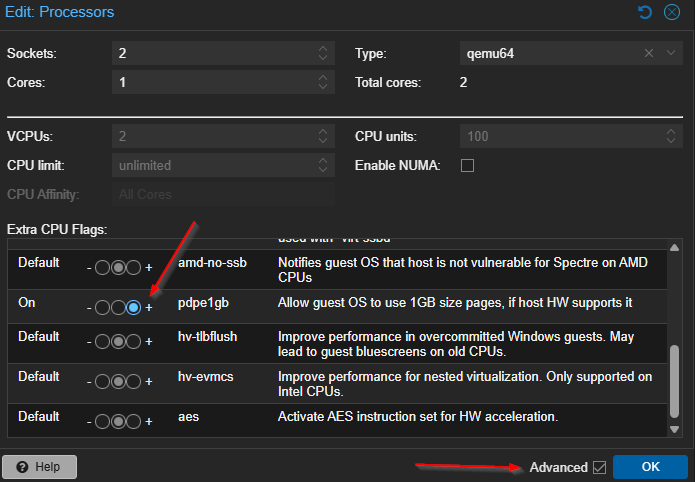

## Proxmox VE Best Practices Guide — Overview and Structure

### Purpose and Scope

This guide documents SOClogix-recommended best practices for operating Proxmox VE in production environments. It focuses on practical security hygiene, stable performance defaults, and common operational decisions. This is not a CIS benchmark or compliance audit and does not attempt to enumerate every possible hardening control. Instead, it provides opinionated guidance for the configurations and decisions most commonly encountered in real-world deployments.

Deviations from these recommendations are permitted when justified by workload requirements or architectural constraints, but such deviations should be intentional and documented.

#### Out of Scope

This guide does not cover the following topics:

- Full CIS benchmarks or compliance audits
- Regulatory or standards-based compliance mapping
- Storage-vendor-specific tuning and optimizations
- Guest operating system hardening
- Application-level performance tuning

#### Keep in Mind
- The sections of this guide are not necessarily done in order of "do this first" to "do this last".
- Review each section and determine which items you will implement first.
- Do not implement an action just because it is listed in this guide.  
First, ensure it meets organization needs, policy requirements, etc.

---

### I. Before You Start

#### 1. Conduct Backups/Snapshots

Before making any major changes, be sure to at least do the following:

- Take a backup of any config file before you edit it
- Apply changes on one node first if this is a cluster
- Reboot only when you have a maintenance window
- After any sysctl change, verify it actually loaded

Here is a nice quick “checkpoint” command list that you can use to capture a few important configuration settings.

```bash
# Snapshot current state you can refer back to
cp -a /etc/sysctl.d /etc/sysctl.d.bak.$(date +%F)
cp -a /etc/apt/apt.conf.d /etc/apt/apt.conf.d.bak.$(date +%F)
cp -a /etc/logrotate.conf /etc/logrotate.conf.bak.$(date +%F)

# See current sysctl overrides
sysctl --system | tail -n 50 >> "current_sysctl_overrides_backup-$(date +%F_%H%M%S).txt"
```
Individual code-blocks for copying:
```
cp -a /etc/sysctl.d /etc/sysctl.d.bak.$(date +%F)
```
```
cp -a /etc/apt/apt.conf.d /etc/apt/apt.conf.d.bak.$(date +%F)
```
```
cp -a /etc/logrotate.conf /etc/logrotate.conf.bak.$(date +%F)
```
```
sysctl --system | tail -n 50 >> "current_sysctl_overrides_backup-$(date +%F_%H%M%S).txt"
```
> Exclude `>> current_sysctl_overrides_backup.txt` if you just want to see the output of current sysctl overrides.

If you want to setup a script to run the commands to run, then copy the above code-block with all of the commands and paste them into a new script which can be created, made executable, and ran via the following commands:  
Open / Create Script using nano:
```
nano checkpoint_snapshot.sh
```
> replace nano with vi, vim, etc. if you prefer a different editor.

Save and exit the editor.
> - **nano:** Press `Ctrl + X`, then press `Y` to confirm saving changes, then press `Enter` to confirm the filename.
> - **vi / vim:** Press `Esc`, type `:wq`, then press `Enter` to write and quit.

Make script executable:
```
chmod +x checkpoint_snapshot.sh
```
Run Script:
```
./checkpoint_snapshot.sh
```
> Make sure to change the filepath for `current_sysctl_overrides_backup.txt` if you want it to be written to a specific directory other than the current working directory.

#### 2. PVE Post Install Helper Script

This helper script provides a guided, interactive way to complete common post-install setup tasks on a Proxmox VE host. It includes options for managing Proxmox repositories (disabling the Enterprise repo, enabling the No-Subscription repo, adding/correcting sources, optionally enabling the test repo), disabling the subscription nag, updating Proxmox VE packages, and rebooting the system.

> **Performance**
>
> Ensures the host is using the correct and intended package repositories, receives updates reliably, and reduces configuration drift. Running updates early also helps avoid stability issues caused by outdated packages or missing fixes.
>
> **Trade-off**
>
> This script modifies system configuration and may change repository behavior. Enabling the test repository is not recommended for production environments. System updates and reboots should be planned carefully to avoid impacting running workloads.

Execute within the Proxmox shell.

> It is recommended to answer `yes` (`y`) to most options presented during the process.  
> Do not enable the Test Repository  
> The ` Disable subscription nag?` option for this script no longer works. Say yes anyways or the script ends.  
> Recommended to leave High Availability Enabled  
> Recommended to not use this scripts Proxmox Update feature. Run updates manually after.  
> Do not approve a reboot if VMs or containers are running on the host.  

**Repository options explained**
> - **No-Subscription Repository:** Recommended for most non-enterprise Proxmox deployments. Provides stable updates without requiring a paid subscription, but should still be treated like production updates and applied during a maintenance window.
> - **Test Repository:** Intended for testing and early validation of upcoming packages. This repository can introduce breaking changes and should generally be avoided on production hosts unless you have a specific reason and a rollback plan.
> - **Ceph Repository:** Only enable this if you are running Ceph (or explicitly plan to). It provides Ceph-related packages that align with Proxmox-supported versions. Enabling it unnecessarily can introduce additional packages and update scope that most standalone hosts do not need.


To run the script, use the following command **only** in the Proxmox VE Shell:

```
bash -c "$(curl -fsSL https://raw.githubusercontent.com/community-scripts/ProxmoxVE/main/tools/pve/post-pve-install.sh)"
```

**Source:**  
[PVE Post Install Script](https://community-scripts.github.io/ProxmoxVE/scripts?id=post-pve-install&category=Proxmox+%26+Virtualization)  

#### 3. Run PVE Updates / Upgrades

Keeping Proxmox updated is one of the most important operational best practices. Updates deliver security fixes, kernel improvements, and stability patches for both Proxmox and the underlying Debian base.

This section provides a repeatable update workflow using a simple script. It also includes an optional kernel pinning step as a cautionary safeguard to reduce the risk of boot issues after a kernel update.

> **Performance**
>
> Regular updates keep the host stable, improve hardware compatibility, and ensure Proxmox services benefit from upstream bug fixes and performance improvements.
>
> **Trade-off**
>
> Updates (especially kernel updates) can introduce regressions or require reboots. Kernel pinning can reduce reboot risk but must be revisited during planned maintenance to ensure the host does not stay pinned indefinitely.

---

##### Step 1: Collect the current kernel version

Before creating the script, capture the host’s currently running kernel version:

```
uname -r
```

You will use this value to populate the `proxmox-boot-tool kernel pin` line in the update script. This pins the currently running kernel so that if a newly installed kernel causes a boot issue, you retain a known-good kernel selection during reboot.

> Kernel pinning should be treated as a cautious operational safeguard.  
> Update the pinned kernel intentionally during a maintenance cycle where someone can be physically present to recover the host if needed (for example, selecting an older kernel from the boot menu).

---

##### Step 2: Create the update script

Create the script at `/bin/run_updates`:

```
nano /bin/run_updates
```

> Replace `nano` with `vi`, `vim`, or another editor if you prefer a different editor.

Paste the following contents into the file. Replace the pinned kernel version with the output of `uname -r` from Step 1:

```
#! /bin/bash
apt-get autoclean
apt update
apt upgrade -y
apt autoremove -y
proxmox-boot-tool kernel pin <YOUR_CURRENT_KERNEL_VERSION>
```
> See below `Alternate script (no kernel pinning)` section for explanation of apt commands

Example (do not copy this example version unless it matches your `uname -r` output):

`proxmox-boot-tool kernel pin 6.8.12-10-pve`

Save and exit the editor.

> Save and exit the editor:
>
> - **nano:** Press `Ctrl + X`, then press `Y` to confirm saving changes, then press `Enter` to confirm the filename.
> - **vi / vim:** Press `Esc`, type `:wq`, then press `Enter` to write and quit.

---

##### Step 3: Make the script executable

```
chmod +x /bin/run_updates
```

---

##### Step 4: Run updates

Run the script:

```
run_updates
```
> This performs a standard upgrade cycle (update, upgrade, autoremove) and pins the current kernel version to reduce reboot risk from unexpected kernel behavior.  
> Prepend `sudo` if using a non-root user
---

##### Operational guidance for kernel pinning

Pinning the current kernel helps ensure you always have a known-good kernel available after updates. However, it also means you should periodically update the pinned kernel intentionally as part of a maintenance window. Treat kernel changes as a planned operational event.

If you have out-of-band management (such as iDRAC, iLO, or similar remote console access), you may not need to pin the kernel, since you can remotely recover the host by selecting an older kernel at boot without being physically present.

---

##### Alternate script (no kernel pinning)

If you have iDRAC or another remote console solution that provides full out-of-band access, you can use this simplified version:

```
#! /bin/bash
apt-get autoclean
apt update
apt upgrade -y
apt autoremove -y
```
> **Update script command breakdown**
>
> - `apt-get autoclean` removes outdated package files from the local APT cache. This helps reclaim disk space by deleting package files that can no longer be downloaded (obsolete versions).
>
> - `apt update` refreshes the package index from configured repositories. This does not install updates, but ensures the system knows what versions are available.
>
> - `apt upgrade -y` installs available package updates without removing packages. The `-y` flag automatically answers “yes” to prompts, allowing the upgrade to run non-interactively.
>
> - `apt autoremove -y` removes packages that were automatically installed as dependencies but are no longer required. This helps keep the system clean and reduces disk usage over time.


---

### II. Host-Level Security Best Practices

This section covers baseline security hygiene that should be implemented on all Proxmox VE hosts unless there is a documented exception.

Topics include:

- SSH hardening, including disabling password authentication and requiring public key authentication
- Restricting or disabling direct root login over SSH
- Creating a local, non-root administrative user for console and emergency access
- Using sudo for privilege escalation and retaining root for break-glass scenarios only
- Limiting management access to trusted networks
- Avoiding exposure of the Proxmox Web UI to untrusted or public networks
- Maintaining system updates and defining a reboot strategy for kernel updates
- Ensuring time synchronization and basic logging practices
- Installing and maintaining CPU microcode updates using the Proxmox VE Processor Microcode Helper Script to address hardware-level security vulnerabilities and stability issues

#### 1. Setup non-root Linux user
> You can reasonably skip this section if you followed `Section 2: Join the Proxmox Host to the Active Directory Domain` of the PVE AD Authentication Guide as you will be able to logon using your AD account: `user@domain.com`

In enterprise environments, direct root logins should be avoided for day-to-day administration. Creating a dedicated administrative user improves auditability, reduces the risk of accidental destructive commands, and enables more controlled access patterns (such as MFA-backed SSH keys, per-user sudo logging, and account-level offboarding).

> **Security**
>
> Using a named, non-root account improves accountability and traceability.  
> Administrative actions can be attributed to an individual user rather than a shared `root` login.
>
> **Trade-off**
>
> This introduces an extra step for privileged actions (`sudo`).  
> However, the operational overhead is minimal compared to the security and audit benefits.  

---

**Install `sudo` (required on Proxmox VE)**  
> Proxmox VE does not install `sudo` by default. If you plan to administer the host using a non-root user, install `sudo` first so the user can perform privileged actions in a controlled and auditable way.  

Install `sudo`:  
```
apt update && apt install -y sudo
```
Verify it is installed:
```
sudo -V
```
---

Create a dedicated administrative user (replace `adminuser` with your preferred name):
```
adduser adminuser
```

Add the user to the `sudo` group to allow administrative access:
```
usermod -aG sudo adminuser
```
> It is not necessary to set `Full Name`, `Room Number`, `Work Phone`, `Home Phone`, or `Other` for the new user.

Verify group membership:

```
id adminuser
```
> OR
```
groups adminuser
```
Test sudo access by switching to the new user and running a privileged command:

```
su - adminuser
```

```
sudo -V
```

> If you are using SSH key-based access, configure the user’s authorized keys under `/home/adminuser/.ssh/authorized_keys` and verify login works before disabling root SSH access.

Optional (recommended for enterprise operations): enforce least privilege by requiring sudo for administrative commands and avoid using `su` to switch to root for routine tasks.

#### 2. Enforce least privilege with `sudo`

In enterprise environments, routine administration should be performed from a named, non-root account with `sudo` privileges rather than switching directly to the `root` user. This supports least privilege, improves accountability, and makes it easier to audit administrative actions.

> **Why this matters**
>
> Using `sudo` creates a clearer separation between normal user activity and privileged actions. It also provides better logging and reduces the risk of accidental destructive commands being run in a fully privileged shell.

---

**Best practice (balanced)**

This approach is recommended for most enterprise environments. It enforces least privilege while preserving controlled break-glass access for recovery workflows.

> The following approaches address privilege escalation in different ways.:
>
> - Restricting `su` controls **who is allowed to switch to the root account**.
> - A `sudo` policy controls **what privileged commands a user can run**, and provides better auditing of administrative actions.
>
> For most enterprise environments, both should be implemented together to prevent privilege bypass and ensure all elevated actions are attributable to a named user.

##### Enforce least privilege through `sudo` policy
> This is unneccessary if already completed as part of creating a non-root user.

Install `sudo` if it is not already installed:

`apt update && apt install -y sudo`

Add the administrative user to the `sudo` group:

`usermod -aG sudo adminuser`

> The `sudo` group grants full administrative privileges by default. If your organization requires more restrictive privileges, define a dedicated sudo policy instead of using full sudo group membership.

---

> If using a non-root user, make sure that you prepend `sudo` to commands 

##### Restrict `su` to a specific group

Create a group for users allowed to use `su`:

```
groupadd suusers
```

Add approved administrative users to the group:

```
usermod -aG suusers adminuser
```

Edit the `su` PAM policy:

```
nano /etc/pam.d/su
```

Add the following line near the top of the file:

```
# This restricts su usage to users in the suusers group
auth required pam_wheel.so group=suusers
```

> This restricts the use of `su` so only members of the `suusers` group can switch to the root account.

---

##### Improve auditing and enforcement (enterprise-ready)

Enable logging for sudo activity:

```
visudo
```

Add the following lines:

```
Defaults        logfile="/var/log/sudo.log"
```

> This creates a dedicated sudo audit log for administrative actions.

Optional (more strict): shorten the sudo timestamp window so users re-authenticate more frequently:

```
Defaults        timestamp_timeout=5
```

> This reduces the chance of unattended terminals retaining elevated privileges.  
> The default sudo timeout is commonly 5–15 minutes depending on distribution and organizational hardening policies. Each successful sudo command refreshes the timeout window, extending the time before the next password prompt. Always verify your effective timeout by checking timestamp_timeout in /etc/sudoers or using `visudo`.


---

**High-control environments**

This approach is intended for highly regulated environments where root switching must be tightly controlled or eliminated. Only use this if you have validated your emergency recovery process and have console access (or out-of-band management such as iDRAC/iLO).

##### Disable `su` entirely (stronger control)

Remove the SUID bit from `/bin/su` to prevent any user from using `su`:

```
chmod u-s /bin/su
```

Verify the SUID bit is removed:

```
ls -l /bin/su
```

> This forces all privileged activity through `sudo` and prevents root switching entirely. Ensure you have at least one working sudo-enabled account and out-of-band access before doing this.

---

##### Enforce least privilege through restricted `sudo` rules

Instead of granting full root access, restrict what commands the administrative user may run:

```
visudo -f /etc/sudoers.d/adminuser
```

Example policy (adjust to your operational needs):

```
adminuser ALL=(root) /usr/bin/systemctl *, /usr/bin/journalctl *, /usr/bin/apt *, /usr/bin/apt-get *
```

> Restricted sudo rules provide true least privilege, but require ongoing maintenance as operational requirements evolve.

---

##### Improve auditing and enforcement (high-control)

Enable dedicated logging:

```
visudo
```

Add:

```
Defaults        logfile="/var/log/sudo.log"
```

Optional: force sudo to require a password every time:

```
Defaults        timestamp_timeout=0
```

> This prevents reuse of cached sudo credentials and ensures every privileged action is deliberate.

Optional (advanced): enable sudo I/O logging (where supported):

```
Defaults        log_input,log_output
```

> This provides stronger auditability but can generate significant log volume. Ensure log forwarding and storage retention policies are in place.

---

**Operational guidance**

- Use `sudo <command>` for one-off administrative actions instead of switching to root.
- Avoid `su -` for routine work, even in balanced environments.
- Maintain a documented break-glass process (console access, emergency credentials, and recovery procedures) for root-level recovery scenarios.

#### 3. Configure SSH Access and Settings

Configuring SSH correctly is critical in enterprise environments.   
The goal is to enforce strong authentication, reduce attack surface, and ensure cluster operations are not disrupted.

> Make sure to align all SSH settings with your organization’s security requirements and access policies.
>
> It is generally **not recommended** to set `PermitRootLogin no` on Proxmox clusters unless you have validated that all cluster operations, automation, and break-glass procedures are still supported. Proxmox clusters use SSH keys for node-to-node communication, and overly restrictive root login policies can complicate recovery workflows.
>
> Always check the bottom of the SSH config file for duplicate or overriding settings (for example, an additional `PasswordAuthentication yes` entry later in the file).

---

##### Edit the SSH daemon configuration

```
nano /etc/ssh/sshd_config
```

> Replace `nano` with `vi`, `vim`, or another editor if you prefer a different editor.

---

##### Find, enable, and set the following values

```
Port 22
PermitRootLogin prohibit-password
PubkeyAuthentication yes
PasswordAuthentication no
PermitEmptyPasswords no
PrintLastLog yes
```

> `PermitRootLogin prohibit-password` allows root login only using SSH keys (no password authentication).  
> This supports cluster node communication while still blocking password-based root access.

---

##### Validate and apply the configuration

Test the SSH configuration for syntax errors:

`sshd -t`

Reload SSH to apply changes without dropping active sessions:

`systemctl reload ssh`

> Use `reload` instead of `restart` to reduce the chance of disconnecting active administrative sessions.

---

#### Generate a private/public key pair

For enterprise environments, key-based authentication should be mandatory for administrative access.

> We recommend using Bitvise SSH Client’s **Client Key Manager** for key generation and management.
>
> Standardize on the `Ed25519` algorithm unless your organization requires otherwise.
>
> Use a passphrase for private keys to reduce risk if a key file is exposed.

If you are not using Bitvise, generate an Ed25519 key pair from the Proxmox host (or your admin workstation):

```
ssh-keygen -t ed25519 -a 64 -C "adminuser"
```
> The `-a 64` option increases key derivation rounds, making passphrase brute-forcing significantly harder.
> Replace `adminuser` with your username. Include your domain name if using an AD user.

---

#### Export an OpenSSH-format public key

If you are using Bitvise, you can export the public key in OpenSSH format using the Client Key Manager.

If you generated the key using `ssh-keygen`, the OpenSSH public key is already available as:
```
~/.ssh/id_ed25519.pub
```
You can display it for copy/paste with:
```
cat ~/.ssh/id_ed25519.pub
```

---

#### Add the public key to the administrative user

Place the public key into the target user’s authorized keys file (Make sure to replace `adminuser` with your username):

```
mkdir -p /home/adminuser/.ssh
```
```
chmod 700 /home/adminuser/.ssh
```
```
nano /home/adminuser/.ssh/authorized_keys
```
Paste the public key and save.   
> Example key: `ssh-ed25519 JJJJB4PzaA2lZDI1HTY8JAJJILST+ad7U1ShZ+e04Kg4t1VC1wUnyCfbqrSxnofHRSqe`    
> The above key is fake, do not use it.  

Then set permissions:
```
chmod 600 /home/adminuser/.ssh/authorized_keys
```
```
chown -R adminuser:adminuser /home/adminuser/.ssh
```
> Correct permissions are required or SSH will ignore the key for security reasons.

---

#### Verify key-based login

From your workstation:

```
ssh adminuser@<proxmox-hostname-or-ip>
```
> Or use your chosen SSH tool such as PuTTY, Bitvise, mRemoteNG, etc.  

Once verified, ensure that password authentication remains disabled (`PasswordAuthentication no`) and that only authorized users can access SSH.

#### 4. PVE Processor Microcode

Processor microcode is a layer of low-level software that runs on the CPU and can be updated to apply vendor-provided fixes. Microcode updates can address hardware errata, improve stability, and mitigate certain security vulnerabilities at the processor level. In enterprise environments, keeping microcode current is an important part of maintaining a secure and reliable virtualization platform.

Microcode can often be updated through the operating system, but availability and update mechanisms vary by platform and CPU vendor. Some systems also rely on firmware update mechanisms such as Intel Management Engine (ME) or AMD Platform Security Processor (PSP). Consult your server platform and CPU vendor documentation to confirm supported update paths and any required coordination with BIOS/firmware updates.

> **Performance**
>
> Microcode updates can resolve CPU errata and improve stability, and in some cases can improve performance by correcting inefficient behavior or improving instruction handling.
>
> **Trade-off**
>
> Microcode updates can change CPU behavior and may affect performance characteristics in certain workloads. Updates should be tested on a staging node first, applied during a maintenance window, and paired with a controlled reboot plan.

Execute within the Proxmox shell.

To run the script, use the following command **only** in the Proxmox VE Shell:

```
bash -c "$(curl -fsSL https://raw.githubusercontent.com/community-scripts/ProxmoxVE/main/tools/pve/microcode.sh)"
```

> This script installs or updates the appropriate Intel or AMD microcode packages for the host.

Reboot the host after installation so the updated microcode can be applied.
> If VMs or containers are running, schedule a maintenance time to reboot.

After rebooting, verify that microcode updates are in effect:

```
journalctl -k | grep -E "microcode" | head -n 1
```
> This will give a result such as: `Jan 06 16:22:39 alphonsus kernel: microcode: Current revision: 0x00000028`

**Source:**  
[PVE Processor Microcode](https://community-scripts.github.io/ProxmoxVE/scripts?id=microcode&category=Proxmox+%26+Virtualization)

#### 5. Improve entropy generation with haveged

Headless servers and virtualized environments can suffer from low entropy. On Linux systems like Proxmox, entropy provides the randomness required for cryptographic operations such as key generation, TLS initialization, SSH, and other security-sensitive tasks.

Entropy is normally collected from unpredictable hardware and timing events. On systems with limited hardware randomness or no user interaction, the entropy pool may fill slowly, leading to delays or blocking behavior.

`haveged` (Hardware Volatile Entropy Gathering and Expansion) is a userspace daemon that supplements system entropy by leveraging small variations in CPU execution timing and cache behavior. This helps keep the kernel’s random number generator sufficiently seeded and avoids stalls in entropy-dependent operations.

On modern hardware with reliable RNG support (such as `RDRAND` or `RDSEED`), `haveged` may be less critical.   
It remains useful on older systems, virtual machines, or environments where entropy exhaustion has been observed.

**Install haveged**
```
apt-get install -y haveged
```
```
tee /etc/default/haveged >/dev/null <<'EOF'
DAEMON_ARGS="-w 1024"
EOF
```
```
systemctl daemon-reload
```
```
systemctl enable haveged && systemctl start haveged
```
**Verify:**
```
cat /proc/sys/kernel/random/entropy_avail
```
```
systemctl status haveged --no-pager
```

#### 6. Configure kernel panic auto-reboot
It is more on the rare side to experience a kernel panic. But they do happen. A host that has a kernel panic and is stuck is one of the worst things that can happen, especially if you are away from home and you can’t “poke it in the eye.”

**This allows you to configure it to autoreboot:**
```
echo "kernel.panic = 10" | tee /etc/sysctl.d/99-kernelpanic.conf
```
```
echo "kernel.panic_on_oops = 1" | tee -a /etc/sysctl.d/99-kernelpanic.conf
```
```
sysctl -p /etc/sysctl.d/99-kernelpanic.conf
```

**Verify it applied:**
```
sysctl kernel.panic kernel.panic_on_oops
```

---

### III. Proxmox Web UI Permissions and Roles Best Practices

This section focuses on best practices for managing authorization within the Proxmox Web GUI, independent of the underlying authentication source. It applies equally to environments using local Proxmox authentication as well as enterprise environments integrated with Active Directory (or another external identity provider).

Topics include:

- Understanding Proxmox roles and privilege separation
- Assigning permissions using Proxmox objects and path-based scope
- Avoiding overuse of the `PVEAdmin` role and the `Administrator` role
- Creating custom roles when default roles are overly permissive
- Ensuring permissions align with operational responsibilities
- Using group-based permission assignments instead of individual users

Authentication backends (such as Active Directory) are assumed to be configured separately and are not covered in this section. This section focuses on how to apply permissions correctly once users and groups exist in Proxmox.

---

#### 1. Understanding Proxmox roles and privilege separation

**Roles**

A role is simply a list of privileges. Proxmox VE comes with a number of predefined roles, which satisfy most requirements.   
You can view the full set of predefined roles in the Proxmox GUI.

Predefined roles include:

- `Administrator`: has full privileges
- `NoAccess`: has no privileges (used to forbid access)
- `PVEAdmin`: can do most tasks, but has no rights to modify system settings (`Sys.PowerMgmt`, `Sys.Modify`, `Realm.Allocate`) or permissions (`Permissions.Modify`)
- `PVEAuditor`: has read only access
- `PVEDatastoreAdmin`: create and allocate backup space and templates
- `PVEDatastoreUser`: allocate backup space and view storage
- `PVEMappingAdmin`: manage resource mappings
- `PVEMappingUser`: view and use resource mappings
- `PVEPoolAdmin`: allocate pools
- `PVEPoolUser`: view pools
- `PVESDNAdmin`: manage SDN configuration
- `PVESDNUser`: access to bridges/vnets
- `PVESysAdmin`: audit, system console and system logs
- `PVETemplateUser`: view and clone templates
- `PVEUserAdmin`: manage users
- `PVEVMAdmin`: fully administer VMs
- `PVEVMUser`: view, backup, configure CD-ROM, VM console, VM power management

---

#### 2. Assign permissions using objects and paths

**Objects and Paths**

Access permissions are assigned to objects, such as virtual machines, storages, or resource pools. Proxmox uses file system-like paths to address these objects. These paths form a natural tree, and permissions at higher levels (shorter paths) can optionally be propagated down within this hierarchy.

Paths can also be templated. When an API call requires permissions on a templated path, the path may contain references to parameters of the API call. These references are specified in curly braces. Some parameters are implicitly taken from the API call’s URI. For instance, the permission path `/nodes/{node}` when calling `/nodes/mynode/status` requires permissions on `/nodes/mynode`, while the path `{path}` in a PUT request to `/access/acl` refers to the method’s path parameter.

Some common examples:

- `/`: The root level, granting access to all objects in the datacenter. Permissions here affect the entire cluster.
- `/nodes`: Access to all Proxmox VE nodes in the cluster.
- `/nodes/{node}`: Access to Proxmox VE server machines
- `/vms`: Access to all VMs
- `/vms/{vmid}`: Access to a specific VM
- `/storage/{storeid}`: Access to a specific storage
- `/pool/{poolname}`: Access to resources contained in a specific pool
- `/access/groups`: Group administration
- `/access/realms/{realmid}`: Administrative access to realms

> Best practice is to assign permissions at the lowest reasonable path to limit scope and reduce unintended inherited access.

**Inheritance**

Object paths form a file system like tree, and permissions can be inherited by objects down that tree (the propagate flag is set by default). Proxmox VE uses the following inheritance rules:

- Permissions for individual users always replace group permissions.
- Permissions for groups apply when the user is member of that group.
- Permissions on deeper levels replace those inherited from an upper level.
- `NoAccess` cancels all other roles on a given path.
- Privilege separated tokens can never have permissions on any given path that their associated user does not have.

> Inheritance is powerful but can lead to unintended access if permissions are granted too high in the tree. Prefer narrow paths and review the propagate flag carefully.

---

#### 3. Avoid overuse of `PVEAdmin` and `Administrator`

Both `PVEAdmin` and `Administrator` are high-privilege roles and should be reserved for trusted infrastructure administrators.

- `Administrator` has full privileges and should be tightly restricted.
- `PVEAdmin` is still highly privileged and can perform most operational tasks, but it cannot modify certain system settings or permissions.

Use cases for limited roles:

- VM operators should typically use `PVEVMUser` scoped to the appropriate VM paths or pools. 
- Reserve `PVEVMAdmin` for teams responsible for full VM lifecycle management, including hardware configuration changes.
- Auditors and support teams should use `PVEAuditor` or a restricted read-only role.

> Avoid granting cluster-wide `Administrator` or `PVEAdmin` access unless it is operationally required and documented.

---

#### 4. Create custom roles when defaults are overly permissive

If built-in roles do not map cleanly to your operational model, create custom roles that match enterprise responsibilities. Custom roles reduce the need for broad administrative access and support least privilege without relying on individual exceptions.

You can add new roles via the GUI or the command line.

**Create a role via the GUI**

- Datacenter → Permissions → Roles → Create
- Set a role name
- Select privileges from the **Privileges** drop-down menu

**Create a role via the command line**

Use the `pveum` CLI tool, for example:

`pveum role add VM_Power-only --privs "VM.PowerMgmt VM.Console"`

`pveum role add Sys_Power-only --privs "Sys.PowerMgmt Sys.Console"`

> Roles starting with `PVE` are always builtin. Custom roles are not allowed to use this reserved prefix.

**Privileges**

A privilege is the right to perform a specific action. To simplify management, lists of privileges are grouped into roles, which can then be used in the permission table. Privileges cannot be directly assigned to users and paths without being part of a role.

Node / System related privileges:

- `Group.Allocate`: create/modify/remove groups
- `Mapping.Audit`: view resource mappings
- `Mapping.Modify`: manage resource mappings
- `Mapping.Use`: use resource mappings
- `Permissions.Modify`: modify access permissions
- `Pool.Allocate`: create/modify/remove a pool
- `Pool.Audit`: view a pool
- `Realm.AllocateUser`: assign user to a realm
- `Realm.Allocate`: create/modify/remove authentication realms
- `SDN.Allocate`: manage SDN configuration
- `SDN.Audit`: view SDN configuration
- `Sys.Audit`: view node status/config, Corosync cluster config, and HA config
- `Sys.Console`: console access to node
- `Sys.Incoming`: allow incoming data streams from other clusters (experimental)
- `Sys.Modify`: create/modify/remove node network parameters
- `Sys.PowerMgmt`: node power management (start, stop, reset, shutdown, …)
- `Sys.Syslog`: view syslog
- `User.Modify`: create/modify/remove user access and details

Virtual machine related privileges:

- `SDN.Use`: access SDN vnets and local network bridges
- `VM.Allocate`: create/remove VM on a server
- `VM.Audit`: view VM config
- `VM.Backup`: backup/restore VMs
- `VM.Clone`: clone/copy a VM
- `VM.Config.CDROM`: eject/change CD-ROM
- `VM.Config.CPU`: modify CPU settings
- `VM.Config.Cloudinit`: modify Cloud-init parameters
- `VM.Config.Disk`: add/modify/remove disks
- `VM.Config.HWType`: modify emulated hardware types
- `VM.Config.Memory`: modify memory settings
- `VM.Config.Network`: add/modify/remove network devices
- `VM.Config.Options`: modify any other VM configuration
- `VM.Console`: console access to VM
- `VM.GuestAgent.Audit`: issue informational QEMU guest agent commands
- `VM.GuestAgent.FileRead`: read files from the guest via QEMU guest agent
- `VM.GuestAgent.FileSystemMgmt`: freeze/thaw/trim file systems via QEMU guest agent
- `VM.GuestAgent.FileWrite`: write files in the guest via QEMU guest agent
- `VM.GuestAgent.Unrestricted`: issue arbitrary QEMU guest agent commands
- `VM.Migrate`: migrate VM to alternate server on cluster
- `VM.PowerMgmt`: power management (start, stop, reset, shutdown, …)
- `VM.Replicate`: configure and run guest replication
- `VM.Snapshot.Rollback`: rollback VM to one of its snapshots
- `VM.Snapshot`: create/delete VM snapshots

Storage related privileges:

- `Datastore.Allocate`: create/modify/remove a datastore and delete volumes
- `Datastore.AllocateSpace`: allocate space on a datastore
- `Datastore.AllocateTemplate`: allocate/upload templates and ISO images
- `Datastore.Audit`: view/browse a datastore

Warning: Both `Permissions.Modify` and `Sys.Modify` should be handled with care, as they allow modifying aspects of the system and its configuration that are dangerous or sensitive.  
Warning: Carefully read the section about inheritance to understand how assigned roles (and their privileges) are propagated along the ACL tree.

---

#### 5. Ensure permissions align with operational responsibilities

Design groups and roles around the teams who perform work:

- Infrastructure administrators
- VM operators / application teams
- Backup operators
- Security / audit teams
- Helpdesk / support roles

> Permissions should support least privilege and separation-of-duties. If a group must have broad permissions, document why and review the assignment periodically.

---

#### 6. Recommended break-glass access (enterprise)

Even in AD environments, maintain a minimal, documented break-glass access path:

- A local Proxmox user not dependent on AD availability
- Stored securely (password vault), rotated regularly, and monitored
- Used only for emergencies and tested periodically

> Break-glass accounts should not be used for routine operations and should have clear ownership and escalation procedures.

---

#### 7. Group-based access model (recommended)

Proxmox permissions should be assigned to **groups**, not individual users. Group-based RBAC supports least privilege, simplifies onboarding/offboarding, and ensures consistent access control across clusters.

> Assigning permissions to individual users makes access control harder to audit, increases the chance of privilege drift, and complicates operational handoffs.

**A. Non-AD environments (local Proxmox users and groups)**  
> Skip to `B. AD environments (recommended for enterprise)` below if using an AD integrated environment.

In environments not integrated with Active Directory, use Proxmox “local” users and groups to implement consistent RBAC.

**Create a local Proxmox user (if not already done)**

If you have not yet created a dedicated local Proxmox user (recommended), create one first.  
This improves accountability and avoids relying exclusively on the built-in `root@pam` account for day-to-day management.

For clustered environments, prefer using the **Proxmox VE authentication server** (`pve` realm) instead of `pam`. `pve` users are stored and managed within Proxmox and are available across all nodes in the cluster, while `pam` users are local to each individual host.

- Datacenter → Permissions → Users → Add
- Realm: `pve` (Proxmox VE authentication server)
- Username: e.g., `proxmoxadmin`
- Ensure strong password requirements and enable MFA where supported

> In enterprise environments, local accounts should be limited in number, documented, and protected by strong password and MFA policies. Consider reserving the `root@pam` account as a break-glass or emergency-only account.

**Create local Proxmox groups**

Create at least two baseline groups:

- `ProxmoxAdmins`
- `ProxmoxUsers`

> These group names are examples. Use naming that matches your organization’s standards.

Create the groups in the Proxmox Web UI:

- Datacenter → Permissions → Groups → Create

**Add local users to groups**

- Datacenter → Permissions → Users
- Double-click the user entry (or select the user and click **Edit**) → Assign the user to the appropriate group (`ProxmoxAdmins` or `ProxmoxUsers`)

**Assign roles to groups (not users)**

- Datacenter → Permissions → Add → Group Permission
- Select the group and assign a Proxmox role at the appropriate path
> Repeat for all groups

---

**B. AD environments (recommended for enterprise)**

In AD-integrated environments, prefer using AD-synced groups rather than creating and managing local Proxmox groups.

**Use AD-synced security groups**

Create and manage groups in Active Directory such as:

- `ProxmoxAdmins`
- `ProxmoxUsers`
- `ProxmoxReadOnly`
- `ProxmoxVMOperators`

Once available to Proxmox through your authentication backend, assign these groups permissions in Proxmox.

> AD group ownership and membership should align with your organization’s access control governance (ticketing approvals, role-based membership, and offboarding workflows).

**Assign roles to AD groups in Proxmox**

- Datacenter → Permissions → Add → Group Permission
- Select the AD group and assign a Proxmox role at the appropriate path
> Repeat for all groups

> Using AD groups ensures access is automatically revoked when accounts are disabled or removed from the AD group, reducing long-term risk.

**Avoid mixing local and AD models unless required**

If AD is configured, avoid building parallel “local” RBAC models unless you require break-glass local accounts. If break-glass accounts exist, they should be limited, monitored, and documented.

---

### IV. Virtual Machine CPU and Memory Configuration Best Practices

This section provides guidance for CPU and memory settings that apply to the majority of virtual machine workloads. The goal is to balance performance, compatibility, and operational flexibility (especially live migration and cluster scalability) in enterprise environments.

Topics include:

- Recommended CPU types for most workloads and when to avoid host passthrough
- Live migration considerations related to CPU selection
- When and why to enable NUMA
- Memory allocation strategies, including ballooning considerations
- Overcommit guidance and when to avoid aggressive memory overcommit
- High-level discussion of hugepages and when they may be appropriate

---

#### 1. Recommended CPU types and when to avoid host passthrough

For most enterprise workloads, use a **cluster-compatible CPU type** rather than `host` passthrough. This improves compatibility, reduces operational risk, and enables smooth live migration across nodes by ensuring a consistent, predictable CPU feature set across your cluster.

**Recommended CPU model approach**

- Prefer the **`x86-64-v2` / `x86-64-v2-AES` / `x86-64-v3` / `x86-64-v4`** family where supported
- Use **`qemu64`** only for legacy compatibility requirements
- Use **`kvm64`** only when required for older guest OSes or strict compatibility constraints
- Avoid **`host`** unless you have a specific workload requirement and have validated migration constraints

> Using a consistent CPU type across the cluster reduces migration failures and prevents subtle performance or feature mismatches across nodes.

---

**Understanding the `x86-64-v2` / `v3` / `v4` CPU model levels**

The `x86-64-v*` models are standardized CPU feature baselines designed to provide a balance of performance and portability. Each version represents a newer baseline with more modern instruction set requirements.

- **`x86-64-v2`**
  - Broad compatibility across modern server hardware
  - Adds commonly expected instruction sets beyond the original x86-64 baseline
  - Suitable as a cluster-default when hardware generations vary

- **`x86-64-v2-AES`**
  - Same baseline as `x86-64-v2`, but explicitly ensures AES-NI support
  - Useful for workloads where encryption performance matters (TLS-heavy services, VPNs, storage encryption)
  - Recommended when you want a broadly compatible baseline but do not want to lose AES acceleration

- **`x86-64-v3`**
  - Requires additional modern instruction sets (notably AVX/AVX2 class capabilities)
  - Can improve performance in compute-heavy workloads (compression, encryption, analytics, certain databases)
  - Only use if all hosts in the cluster meet the feature requirements

- **`x86-64-v4`**
  - The most modern baseline (includes newer vector instruction capabilities such as AVX-512 class features on capable hardware)
  - Can provide performance improvements for specialized workloads that benefit from these instructions
  - Not recommended as a default unless your cluster hardware is highly consistent and known to support it

> In general:  
> - `x86-64-v2` is the safest broad enterprise default when hardware generations vary.  
> - `x86-64-v2-AES` is a strong default when you want the broad compatibility of `v2` but also want to ensure AES-NI is consistently exposed for encryption-heavy workloads.  
> - `x86-64-v3` is a good option for clusters with uniformly modern CPUs (and can improve performance for compute-heavy workloads).  
> - `x86-64-v4` should be reserved for specialized workloads on very consistent, modern hardware, since it requires newer instruction sets that are not universally available.  


---

**Legacy compatibility models**

- **`qemu64`**
  - Very generic CPU model with high compatibility
  - Often used when maximum portability is required across diverse hardware
  - Can reduce performance by hiding modern CPU features

- **`kvm64`**
  - Similar intent to `qemu64`, but may expose slightly different virtualization features depending on environment
  - May be required for older OSes or extremely compatibility-sensitive workloads
  - Not recommended for modern clusters unless required

> If you have old guests or mixed/unknown CPU hardware, `qemu64` is the most portable option, but it may sacrifice performance and modern CPU acceleration features.

---

**When to avoid or use `host` CPU type**

Using the `host` CPU type in Proxmox VE gives your virtual machines (VMs) the best performance by exposing **all of the host’s CPU features (flags)** directly to the guest. This can improve performance for workloads that benefit from specific CPU accelerations (encryption, compression, SIMD/vector operations, databases, HPC workloads).

However, `host` passthrough significantly limits operational flexibility:

- Live migration may fail if the destination host does not support the exact same CPU flags
- Hardware refreshes or mixed CPU generations can cause VM start failures on other nodes
- Cluster upgrades become more complex because CPU feature sets must remain compatible

> Use `host` only when you have a measured workload requirement, uniform CPU hardware across the cluster, and you have validated that your live migration and recovery workflows still function as expected.

---

**Modern vs legacy CPU examples (helpful when selecting a cluster CPU type)**

The `x86-64-v2` and `x86-64-v2-AES` CPU profiles are designed as broadly compatible baselines and are often the safest default for enterprise clusters, especially when hardware generations vary. The newer `x86-64-v3` and `x86-64-v4` profiles provide additional modern instruction sets and can improve performance, but they work best only when cluster CPU hardware is consistently modern and uniform. If your environment includes older servers or mixed CPU generations, standardizing on `x86-64-v2` (or in extreme legacy cases `qemu64`) helps maintain compatibility and predictable migration behavior.


**Examples of modern enterprise-class CPUs (typically safe for `x86-64-v2` and often `x86-64-v3`)**

- **Intel Xeon Scalable (Skylake-SP and newer):** 2017+ (Bronze/Silver/Gold/Platinum)  
- **Intel Xeon Scalable (Ice Lake / Sapphire Rapids):** 2021+ / 2023+ (strong candidates for `x86-64-v3` and in some cases `x86-64-v4`)  
- **AMD EPYC (Naples / Rome / Milan / Genoa):** 2017+ (solid `v2`, commonly `v3` in homogeneous clusters)  
- **AMD Threadripper / Threadripper Pro (enterprise workstation tiers):** 2017+ (commonly supports `v3`; treat as “server-like” only if deployed consistently across nodes)

**What is typically safe for `x86-64-v4`?**

`x86-64-v4` is the most demanding standardized CPU baseline and generally maps to **AVX-512 class** capabilities.  
It is only a safe cluster default when **every node** supports the required instruction sets.

- **Most commonly safe:** **Intel Xeon Scalable 3rd Gen (Ice Lake-SP) and newer:** 2021+  
- **Strong candidates:** **Intel Xeon Scalable 4th Gen (Sapphire Rapids):** 2023+  
- **Sometimes safe (validate per model):** **Intel Xeon Scalable 2nd Gen (Cascade Lake-SP):** 2019 (many SKUs support AVX-512, but cluster consistency and BIOS exposure still matter)

`x86-64-v4` is **generally not recommended** for:

- **AMD EPYC / AMD Threadripper / AMD-based clusters** (AVX-512 support differs and is not a consistent baseline)
- **Mixed Intel + AMD clusters**
- **Clusters with mixed CPU generations or stepping differences**

> Treat `x86-64-v4` as a specialized baseline for clusters built on uniform Intel AVX-512 capable hardware. For most enterprise clusters, `x86-64-v2` / `x86-64-v2-AES` is the safest default, and `x86-64-v3` is a good choice when hardware is consistently modern.

**Examples of legacy CPUs (often require conservative baselines)**

- **AMD Opteron (many generations):** typically 2010–2016 era (often best suited for `kvm64` or `qemu64` depending on model and compatibility needs)  
- **Intel Xeon 55xx / 56xx (Nehalem/Westmere):** 2009–2011 (legacy baseline; frequently requires older CPU models)  
- **Intel Xeon E5 v1/v2 (Sandy Bridge / Ivy Bridge):** 2012–2013 (may still work with `x86-64-v2`, but cluster consistency must be validated)  
- **Older mixed hardware clusters (pre-2014):** strongly consider `x86-64-v2` or `qemu64` for predictable migration behavior  

As a general rule, **servers from ~2014 or earlier** should be treated as potentially legacy for migration planning, and **servers from 2017+** are typically modern enough for `x86-64-v2` and often `x86-64-v3` if the cluster is consistent.

---

#### 2. Live migration and CPU compatibility considerations

Live migration requires CPU feature compatibility between the source and destination hosts. Even small differences between CPU generations can break migrations when using passthrough CPU types.

Best practices:

- Standardize CPU type at the cluster level
- Avoid mixing CPU families or generations when possible
- When mixing is unavoidable, choose the lowest common CPU model that supports required features
- Validate migration behavior during cluster expansion or hardware refresh

> CPU incompatibility is one of the most common root causes of migration failures in mixed-hardware clusters.
>
> In mixed-hardware environments or when upgrading to newer hardware, it may be necessary to temporarily adjust a VM’s CPU type away from `host` to a more compatible profile (such as `x86-64-v2-AES` or `x86-64-v3`) to enable a successful migration or restore. This change should be performed during a controlled maintenance window and validated to ensure the VM boots and operates correctly under the temporary CPU profile.

---

#### 3. When and why to enable NUMA

NUMA (Non-Uniform Memory Access) awareness is relevant for larger VMs and systems with multiple CPU sockets.  
Enabling NUMA helps the guest OS align CPU scheduling and memory locality, reducing cross-socket memory access penalties.

General guidance:

- For small to medium VMs (low vCPU count, moderate memory), NUMA usually provides little benefit
- For large VMs (high vCPU count and large RAM allocations), NUMA can improve performance and reduce latency

NUMA is most relevant when:

- VMs use large memory allocations (tens of GB or more)
- VMs have high core counts (typically 8+ vCPUs, more often 16+)
- workloads are latency sensitive (databases, analytics, high-throughput services)

> NUMA tuning is most effective when host hardware is properly aligned and the VM is sized to fit within a NUMA node. Poor NUMA alignment can reduce performance rather than improve it.

Key Benefit:  
- Avoids Remote Access: Ensures a VM's vCPUs primarily use memory directly attached to their physical CPU socket, avoiding slow access over the interconnect bus to memory on another socket. 

---

#### 4. Memory allocation strategies and ballooning considerations

Memory allocation strategy is a key performance and stability decision.   
The best approach depends on workload predictability and operational requirements.

Recommended guidance:

- Use fixed memory allocation for most production workloads that require predictable performance
- Use ballooning cautiously and only when you have capacity planning and monitoring in place

**Ballooning**

Ballooning allows the hypervisor to reclaim unused memory from VMs under pressure and redistribute it to other VMs.

Benefits:

- Helps increase consolidation density
- Provides flexibility when workloads are predictable and monitored

Risks:

- Guests may behave unpredictably under reclaimed memory
- Can cause latency spikes, cache eviction, and degraded application performance
- Some workloads perform poorly when memory availability fluctuates

> Ballooning should not be treated as a substitute for proper capacity planning. If a VM is business-critical, allocate the memory it needs and avoid frequent reclamation events.

---

#### 5. Overcommit guidance and when to avoid aggressive overcommit

Memory overcommit enables higher VM density, but it introduces operational risk. Overcommit should be deliberate and aligned with monitoring, workload predictability, and recovery expectations.

General enterprise guidance:

- Light overcommit can be acceptable if workloads are stable and predictable
- Avoid aggressive overcommit unless you have strong monitoring and a clear failure handling strategy
- Avoid overcommit for latency-sensitive workloads (databases, critical service tiers, real-time workloads)

Signs you should reduce overcommit:

- frequent swap activity on the host
- recurring memory pressure events
- ballooning reclamation in critical VMs
- kernel OOM events or service instability
- VM performance anomalies correlated with host memory pressure

> Overcommit failures are not graceful. If the host runs out of reclaimable memory, the kernel may invoke the OOM killer and terminate processes, including Proxmox services or VM-related workloads.

---

#### 6. Hugepages (high-level guidance)

Hugepages reduce memory management overhead by using larger page sizes (typically 2MB pages instead of 4KB pages). They can improve performance for workloads that:

- allocate large contiguous memory regions
- have high TLB pressure
- are highly memory intensive

Potential benefits:

- lower CPU overhead for memory translation
- improved performance for certain databases and high-throughput workloads
- more predictable memory behavior in some cases

Trade-offs:

- memory becomes less flexible and harder to reclaim
- hugepages must be planned and reserved
- over-allocation can reduce available memory for other workloads

> Hugepages should be treated as an advanced optimization. Only enable them when there is a measured performance need and when you understand the memory reservation and operational impacts.

---

**Why HugePages require planning and reservation**

HugePages must be planned and reserved (usually at boot time) because they provide large, contiguous memory blocks for performance-critical workloads. By using larger page sizes (such as 2MB or 1GB), HugePages reduce CPU overhead by lowering Translation Lookaside Buffer (TLB) misses and improving virtual-to-physical address translation efficiency. They are commonly used by large databases, high-throughput networking stacks (such as DPDK), and other memory-intensive applications that benefit from predictable, low-latency memory behavior.

Unlike normal memory pages, HugePages are not dynamically freed and refilled easily. HugePages are pinned (non-swappable) and must be reserved in advance so the kernel can allocate and track the required number of large pages. In many cases, adjusting HugePages allocations requires kernel parameter changes and may require a reboot to take effect reliably, especially when using 1GB pages or when memory fragmentation prevents allocation at runtime.

**Why planning and reservation are necessary**

- **Performance:** Reduces TLB misses by using larger pages (for example 2MB or 1GB), improving address translation speed and reducing CPU overhead in memory-intensive workloads.
- **Contiguity:** Provides large, uninterrupted memory blocks, which can be important for Direct Memory Access (DMA), packet processing (DPDK), large caches, and database buffer pools.
- **Non-swappable:** HugePages are pinned and cannot be swapped to disk, avoiding severe performance hits that occur when large memory regions are swapped under pressure.
- **Kernel limits:** The kernel needs to know how many HugePages to reserve, and in many cases they cannot be added or removed easily after boot without rebooting due to fragmentation or allocation constraints.

**How HugePages are typically configured**

- **Calculate needs:** Determine how much memory the workload should consume as HugePages (for example, Oracle SGA size / HugePage size).
- **Reserve hugepages using kernel parameters:** Configure the number of HugePages to allocate using parameters such as `vm.nr_hugepages` (2MB pages) and, when applicable, page size parameters such as `hugepagesz`.
  - Example configuration location: `/etc/sysctl.conf` or `/etc/sysctl.d/99-hugepages.conf`
- **Optional bootloader configuration:** For large page sizes (such as 1GB) or for deterministic reservation behavior, set HugePages via GRUB kernel command line parameters such as:
  - `default_hugepagesz=1G hugepagesz=1G hugepages=4`
- **Mount `hugetlbfs` (if required):** Some applications require access to HugePages through a mounted filesystem interface.
- **Apply changes:** Use `sysctl -p` for sysctl-managed settings, or reboot the host for kernel command line reservations and to avoid allocation failures due to fragmentation.
- **Disable Transparent HugePages (THP) if necessary:** Many database vendors recommend disabling THP (for example, `transparent_hugepage=never` in GRUB), because THP can introduce fragmentation and unpredictable latency spikes under memory pressure.

**Key takeaway**

HugePages must be planned based on peak workload requirements and reserved in advance. If insufficient HugePages are reserved, applications may fail to start, fail to allocate large contiguous buffers, or lose the performance benefits that HugePages are intended to provide.


---

**Host-level hugepages (Proxmox VE host configuration)**

Hugepages must be made available at the host kernel level before VMs can reliably consume them. This is typically done by configuring kernel parameters via GRUB so the host reserves hugepage memory during boot.

A common configuration is to enable 1GB hugepages for large VMs while leaving the default hugepage size at 2MB for general compatibility:

Edit GRUB:

```
nano /etc/default/grub
```
> Don't forget to prepend `sudo` if using a non-root user.

Example configuration:

`GRUB_CMDLINE_LINUX_DEFAULT="quiet intel_iommu=on hugepagesz=1G default_hugepagesz=2M"`

This example enables 1GB hugepages while keeping 2MB hugepages as the default size for compatibility, and it also enables Intel IOMMU support for passthrough and advanced device isolation use cases.

- `intel_iommu=on` enables the Intel IOMMU (Input–Output Memory Management Unit). This is commonly required for PCI passthrough (`VFIO`), SR-IOV, and strong DMA isolation. If your environment does not use passthrough or SR-IOV, this option is not strictly required.
- `hugepagesz=1G` enables 1GB hugepages on the host.
- `default_hugepagesz=2M` ensures the system still uses 2MB hugepages as the default hugepage size when hugepages are requested without a specific size, preserving compatibility.

> Proxmox VE typically defaults to `GRUB_CMDLINE_LINUX_DEFAULT="quiet"` to keep the kernel command line minimal. Additional parameters should be added only when required by your environment.


Update GRUB and reboot:

```
update-grub
```
> Don't forget to prepend `sudo` if using a non-root user.  
> If using a non-root user without `sudo` then you may get a response saying the command does not exist.
```
reboot now
```

Verify hugepage availability after reboot:

```
cat /proc/meminfo | grep -i Huge
```

> Hugepages are reserved at boot and are not swappable. The reserved memory becomes unavailable to normal host processes unless it is used by hugepage-backed workloads. Plan capacity carefully and avoid reserving excessive hugepages.

---

**VM-specific hugepages (per-VM configuration)**

Hugepages are typically enabled on a per-VM basis so only selected workloads consume reserved hugepage-backed memory.

To configure hugepages for a VM:

1. Stop the VM (required for hugepage changes)

2. Enable the 1GB hugepage CPU flag (required for 1GB hugepages)  

In the Proxmox Web UI:
- VM → Hardware → CPU → enable `+pdpe1gb`  
> Make sure to toggle Advanced settings as enabled (check box).  
> The `pdpe1gb` CPU flag enables the guest to use 1GB pages. Without it, 1GB hugepages will not be usable inside the guest.



3. Add the `hugepages` setting to the VM configuration

HugePages can be enabled per-VM by adding a `hugepages` setting to the VM configuration. This ensures the VM’s memory is backed by HugePages from the host’s reserved pool.

This can be done by editing the VM configuration file or via the `qm set` command.

**Option A: Configure via VM config file**

VM configuration files are stored under:

`/etc/pve/qemu-server/<vmid>.conf`

Edit the VM config file:

```
nano /etc/pve/qemu-server/<vmid>.conf
```
> Make sure to set the correct `vmid` for the `.conf` file.

Add one of the following examples:

- **2MB HugePages**
  - `hugepages: 2`
- **1GB HugePages**
  - `hugepages: 1`

If you want to keep the HugePages reserved after shutdown (optional), add:

- `keephugepages: 1`

Example configuration (2MB HugePages with reservation kept after shutdown):

- `hugepages: 2`
- `keephugepages: 1`

> When using `hugepages: 2`, Proxmox will attempt to allocate VM memory from 2MB hugepages.  
> When using `hugepages: 1`, Proxmox will attempt to allocate VM memory from 1GB hugepages (requires host and guest support, including the `+pdpe1gb` CPU flag).  
> `keephugepages: 1` prevents Proxmox from deleting reserved hugepages after VM shutdown, which can reduce allocation delays and lower the risk of allocation failure due to memory fragmentation.

---

**Option B: Configure via `qm set`**

For **2MB HugePages**:

```
qm set <vmid> --hugepages 2
```
> Make sure to set the correct `vmid`  

For **1GB HugePages**:

```
qm set <vmid> --hugepages 1024
```
```
qm set <vmid> --hugepages any
```
> If the `--hugepages` is set to `any` then 1 GiB hugepages will be used if possible, otherwise the size will fall back to 2 MiB.

If you want Proxmox to keep the HugePages reserved after shutdown (optional):

```
qm set <vmid> --keephugepages 1
```

Example (2MB HugePages with reservation kept after shutdown):

```
qm set <vmid> --hugepages 2 --keephugepages 1
```

> `--keephugepages 1` prevents Proxmox from deleting reserved hugepages after VM shutdown, which can reduce allocation delays and lower the risk of allocation failure due to memory fragmentation. This also reduces hugepage availability for other workloads while the VM is powered off, so capacity planning is required.

---

**Sizing considerations**

- When using **1GB HugePages**, VM memory should be configured as a multiple of 1GB to avoid allocation waste or start failures.
- If insufficient HugePages are available on the host, the VM may fail to start.
- HugePages are reserved and non-swappable, so plan capacity carefully.

> HugePages are not dynamically allocated under pressure. If the host does not have enough free HugePages available, the VM may fail to start or may block other HugePage-backed VMs from starting.


4. Start the VM and validate performance and stability

---

**Key considerations**

- **Performance:** Hugepages reduce CPU overhead for memory management and can improve performance for memory-intensive workloads such as databases, analytics platforms, and virtualization hosts running nested workloads.
- **Memory reservation:** Hugepages are allocated at boot and are not swappable. They reduce available RAM for the host and other VMs, so the reservation must be sized carefully.
- **VM start behavior:** If the host does not have enough available hugepages, the VM may fail to start. Hugepages should be treated as a reserved resource similar to pinned CPU or dedicated storage.
- **Compatibility:** 1GB hugepages require modern CPU support and the `+pdpe1gb` flag enabled on the VM. Mixed-hardware clusters must be validated carefully.
- **THP vs manual hugepages:** Manually configured hugepages are different from Transparent Hugepages (THP). THP can be disabled (`never`) on the host if it causes latency or fragmentation issues for specific workloads.

---

**Operational best practices**

- Use hugepages only when there is a measured benefit for the workload
- Prefer enabling hugepages for specific large VMs rather than broadly across the cluster
- Avoid over-reserving hugepages, as unused reserved memory reduces operational flexibility
- Validate VM start and failover behavior when hugepages are used
- Document hugepage allocations as part of capacity planning and maintenance procedures

---

#### Recommended baseline (enterprise default)

For most enterprise Proxmox clusters:

- Use a consistent cluster-compatible CPU model across nodes
- Avoid `host` passthrough unless required
- Enable NUMA only for large VMs where it provides measurable benefit
- Use fixed memory allocation for critical workloads
- Use ballooning selectively and only with monitoring
- Avoid aggressive memory overcommit in production
- Consider hugepages only for specific workloads with demonstrated benefit


---

### V. Network Interface Best Practices

This section outlines recommended virtual networking configurations for performance and compatibility.

Topics include:

- Using VirtIO network interfaces for most workloads
- Situations where alternative network models may be required
- Multiqueue configuration considerations
- VLAN awareness and tagging considerations
- MTU consistency across hosts and networks

#### 1. Force APT to use IPv4 (when IPv6 causes slow or flaky updates)
If your ISP, router, DNS configuration, or other network component makes IPv6 unreliable, it can cause issues or slow things down.  
**However, we can fix this by forcing IPv4 and it instantly makes updates consistent again.**
```
echo 'Acquire::ForceIPv4 "true";' | tee /etc/apt/apt.conf.d/99force-ipv4
```
**Verify it applied:**
```
cat /etc/apt/apt.conf.d/99force-ipv4
```
**To roll it back:**
```
rm -f /etc/apt/apt.conf.d/99force-ipv4
```
> Prepend `sudo` if using a non-root user

#### 2. Apply network sysctl optimizations

If you have a lot of network traffic (large storage networks, high east-west VM traffic, or generally want tighter and more predictable networking behavior), these sysctl tweaks can help improve throughput, reduce latency spikes, and harden common IPv4 behaviors.

Open/create the network performance tuning file `/etc/sysctl.d/99-network-performance.conf`:
```
nano /etc/sysctl.d/99-network-performance.conf
```
> Replace `nano` with `vi`, `vim`, or another editor if you prefer a different editor.

Paste the following contents into the file:
```
# Proxmox-safe network performance tuning

# Core network buffers
net.core.netdev_max_backlog = 8192
net.core.optmem_max = 8192
net.core.rmem_max = 16777216
net.core.wmem_max = 16777216
net.core.somaxconn = 8151

# IPv4 hardening
net.ipv4.conf.all.accept_redirects = 0
net.ipv4.conf.all.accept_source_route = 0
net.ipv4.conf.all.secure_redirects = 0
net.ipv4.conf.all.send_redirects = 0
net.ipv4.conf.all.log_martians = 0
net.ipv4.conf.all.rp_filter = 1

net.ipv4.conf.default.accept_redirects = 0
net.ipv4.conf.default.accept_source_route = 0
net.ipv4.conf.default.secure_redirects = 0
net.ipv4.conf.default.send_redirects = 0
net.ipv4.conf.default.log_martians = 0
net.ipv4.conf.default.rp_filter = 1

# ICMP sanity
net.ipv4.icmp_echo_ignore_broadcasts = 1
net.ipv4.icmp_ignore_bogus_error_responses = 1

# Ephemeral port range
net.ipv4.ip_local_port_range = 1024 65535

# TCP behavior tuning
net.ipv4.tcp_fin_timeout = 10
net.ipv4.tcp_keepalive_time = 240
net.ipv4.tcp_keepalive_intvl = 30
net.ipv4.tcp_keepalive_probes = 3
net.ipv4.tcp_max_syn_backlog = 8192
net.ipv4.tcp_limit_output_bytes = 65536
net.ipv4.tcp_mtu_probing = 1
net.ipv4.tcp_rfc1337 = 1
net.ipv4.tcp_sack = 1
net.ipv4.tcp_slow_start_after_idle = 0
net.ipv4.tcp_syn_retries = 3
net.ipv4.tcp_synack_retries = 2

# TCP memory buffers
net.ipv4.tcp_rmem = 8192 87380 16777216
net.ipv4.tcp_wmem = 8192 65536 16777216

# UNIX socket queue depth
net.unix.max_dgram_qlen = 4096
```

> **Core network buffer and queue tuning**
>
> `net.core.netdev_max_backlog = 8192`  
> What it is: Maximum number of packets queued on the kernel receive queue when the NIC receives traffic faster than it can be processed.  
> Default / range: Default is commonly `1000` on many distros; practical range depends on memory and traffic patterns.  
> Performance: Reduces packet drops during bursts (VM traffic spikes, backups, replication, Ceph) and improves throughput stability under load.  
> Trade-off: Slightly higher memory usage during sustained backlogs; if set excessively high, it can hide CPU saturation while increasing queueing latency.
>
> `net.core.optmem_max = 8192`  
> What it is: Maximum optional memory allowed per socket (used for certain socket options and ancillary data).  
> Default / range: Defaults vary by kernel; generally small by default and not frequently tuned.  
> Performance: Provides modest per-socket headroom and can help avoid overly tight socket option memory limits under some workloads.  
> Trade-off: Minimal risk; slightly increases per-socket memory allowance with negligible system impact.
>
> `net.core.rmem_max = 16777216` and `net.core.wmem_max = 16777216`  
> What it is: System-wide maximum receive and send buffer sizes per socket (bytes).  
> Default / range: Defaults are often much lower (commonly in the low MB range or below); must be >= the max values used by TCP autotuning.  
> Performance: Allows TCP autotuning and applications to scale buffers for high throughput or higher latency paths (replication, backups, large transfers).  
> Trade-off: Increased potential memory consumption if many sockets scale up simultaneously.
>
> `net.core.somaxconn = 8151`  
> What it is: Maximum pending connection backlog for listen sockets (server accept queue).  
> Default / range: Default is commonly `4096` (sometimes `128` on older systems); effective maximum may be capped by the application’s listen backlog.  
> Performance: Helps services survive connection bursts without refusing clients (API endpoints, web services, reverse proxies).  
> Trade-off: Low risk, but only helps if the application also requests a larger backlog.
>
> **IPv4 hardening and routing correctness**
>
> `net.ipv4.conf.all.accept_redirects = 0` and `net.ipv4.conf.default.accept_redirects = 0`  
> What it is: Controls whether ICMP redirects are accepted (messages claiming a better gateway exists).  
> Default / range: Boolean (`0` or `1`); defaults vary by distro and interface type.  
> Performance: Improves routing determinism and reduces the chance of routing instability caused by redirects.  
> Trade-off: May impact environments that rely on redirects (uncommon and generally discouraged).
>
> `net.ipv4.conf.all.secure_redirects = 0` and `net.ipv4.conf.default.secure_redirects = 0`  
> What it is: Controls acceptance of “secure” redirects from known gateways.  
> Default / range: Boolean (`0` or `1`); defaults vary.  
> Performance: Reduces unexpected route changes and improves deterministic behavior.  
> Trade-off: May affect legacy networks that depend on redirects.
>
> `net.ipv4.conf.all.send_redirects = 0` and `net.ipv4.conf.default.send_redirects = 0`  
> What it is: Controls whether this host sends ICMP redirects to other systems.  
> Default / range: Boolean (`0` or `1`); commonly enabled on systems that forward traffic.  
> Performance: Prevents accidental routing advisory behavior and reduces misrouting risk.  
> Trade-off: No practical downside for typical Proxmox deployments that are not acting as routers.
>
> `net.ipv4.conf.all.accept_source_route = 0` and `net.ipv4.conf.default.accept_source_route = 0`  
> What it is: Controls acceptance of source-routed packets where the sender specifies the route.  
> Default / range: Boolean (`0` or `1`); typically already `0` on modern distros.  
> Performance: Not performance-driven; this is a correctness and security hardening control.  
> Trade-off: No functional downside in modern environments.
>
> `net.ipv4.conf.all.log_martians = 0` and `net.ipv4.conf.default.log_martians = 0`  
> What it is: Controls logging of “martian” packets (invalid or suspicious source/destination addresses).  
> Default / range: Boolean (`0` or `1`); often `0` by default on many distros.  
> Performance: Reduces log noise and prevents disk growth from excessive kernel logging in busy environments.  
> Trade-off: Reduced forensic visibility when diagnosing spoofing or routing issues.
>
> `net.ipv4.conf.all.rp_filter = 1` and `net.ipv4.conf.default.rp_filter = 1`  
> What it is: Reverse path filtering validates that the source IP is reachable via the interface it arrived on.  
> Default / range: Typically `0`, `1`, or `2` depending on distro; `1` is strict mode, `2` is loose mode.  
> Performance: Improves routing correctness and provides strong spoofing protection in typical single-path routing setups.  
> Trade-off: Can break asymmetric routing, advanced multi-homing, VRFs, and policy routing; consider `2` (loose) if you have complex routing requirements.
>
> **ICMP sanity controls**
>
> `net.ipv4.icmp_echo_ignore_broadcasts = 1`  
> What it is: Ignores ICMP echo requests sent to broadcast addresses.  
> Default / range: Boolean (`0` or `1`); often `1` by default on modern systems.  
> Performance: Reduces noise and mitigates classic amplification patterns.  
> Trade-off: No practical downside.
>
> `net.ipv4.icmp_ignore_bogus_error_responses = 1`  
> What it is: Ignores malformed or noncompliant ICMP error responses.  
> Default / range: Boolean (`0` or `1`); often `1` by default on modern systems.  
> Performance: Improves robustness and reduces unnecessary error handling.  
> Trade-off: Minimal risk; may ignore some malformed diagnostics.
>
> **Ephemeral port range expansion**
>
> `net.ipv4.ip_local_port_range = 1024 65535`  
> What it is: Defines the range of ports available for outbound (ephemeral) connections.  
> Default / range: Usually something like `32768 60999` or similar by default; range must be within `1024–65535`.  
> Performance: Reduces the risk of ephemeral port exhaustion in high-connection workloads (reverse proxies, NAT, many short-lived outbound connections).  
> Trade-off: Slightly increases the number of ports in use over time; generally a standard server tuning.
>
> **TCP behavior tuning (latency and connection resilience)**
>
> `net.ipv4.tcp_fin_timeout = 10`  
> What it is: Time a socket remains in FIN-WAIT-2 after close.  
> Default / range: Default is commonly `60` seconds; valid values are positive integers (seconds).  
> Performance: Frees resources faster on high-churn servers and reduces stale connection buildup.  
> Trade-off: Less tolerant of slow or misbehaving peers; could drop lingering connections sooner.
>
> `net.ipv4.tcp_keepalive_time = 240`, `net.ipv4.tcp_keepalive_intvl = 30`, `net.ipv4.tcp_keepalive_probes = 3`  
> What it is: How idle TCP connections are probed to detect dead peers.  
> Default / range: Defaults are commonly `7200` (time), `75` (interval), and `9` (probes); values are integers in seconds/count.  
> Performance: Cleans up dead connections faster and recovers more quickly after network interruptions.  
> Trade-off: Increased keepalive traffic and potentially more frequent disconnect detection on unstable links.
>
> `net.ipv4.tcp_max_syn_backlog = 8192`  
> What it is: Queue size for half-open TCP connections during the handshake.  
> Default / range: Default is often `2048` or `4096`; valid values are integers.  
> Performance: Improves resilience to connection spikes and SYN flood scenarios.  
> Trade-off: Minor memory increase for queued handshakes.
>
> `net.ipv4.tcp_limit_output_bytes = 65536`  
> What it is: Caps per-socket queued output before TCP throttles.  
> Default / range: Default varies by kernel; integer bytes.  
> Performance: Improves fairness and reduces latency caused by excessive buffering per flow (can help mitigate bufferbloat).  
> Trade-off: May slightly reduce peak throughput for single large flows on very fast links.
>
> `net.ipv4.tcp_mtu_probing = 1`  
> What it is: Enables adaptive MTU probing when Path MTU Discovery is unreliable.  
> Default / range: Typically `0` (off) by default; values are `0`, `1`, or `2` depending on kernel behavior.  
> Performance: Improves reliability and reduces black-hole stalls across tunnels, VPNs, and misconfigured networks.  
> Trade-off: Adds minor probing overhead; usually negligible.
>
> `net.ipv4.tcp_rfc1337 = 1`  
> What it is: Protects against TIME-WAIT assassination edge-cases.  
> Default / range: Boolean (`0` or `1`); often `0` by default.  
> Performance: Improves long-lived connection correctness and stability.  
> Trade-off: No practical downside.
>
> `net.ipv4.tcp_sack = 1`  
> What it is: Enables Selective ACKs for efficient retransmissions.  
> Default / range: Boolean (`0` or `1`); usually already `1` by default on modern kernels.  
> Performance: Improves throughput and recovery on lossy or congested links.  
> Trade-off: Minimal downside; should generally remain enabled.
>
> `net.ipv4.tcp_slow_start_after_idle = 0`  
> What it is: Controls whether TCP resets congestion window after idle periods.  
> Default / range: Boolean (`0` or `1`); commonly `1` by default.  
> Performance: Maintains throughput for long-lived connections that pause briefly (replication, backups, clustered services).  
> Trade-off: Can increase congestion risk on oversubscribed or fragile networks.
>
> `net.ipv4.tcp_syn_retries = 3` and `net.ipv4.tcp_synack_retries = 2`  
> What it is: How many retries occur before giving up on connection setup.  
> Default / range: Defaults are commonly `6` and `5`; values are integers.  
> Performance: Faster failure detection when endpoints are unreachable.  
> Trade-off: Less tolerant of very high-latency or packet-loss links; may fail connections sooner in degraded networks.
>
> **TCP memory buffer ranges (autotuning limits)**
>
> `net.ipv4.tcp_rmem = 8192 87380 16777216` and `net.ipv4.tcp_wmem = 8192 65536 16777216`  
> What it is: Minimum, default, and maximum TCP buffer sizes used by autotuning (bytes).  
> Default / range: Defaults vary by kernel; the three values are `min default max`, and max must not exceed `rmem_max/wmem_max`.  
> Performance: Higher maximums improve throughput on high bandwidth-delay product paths (WAN replication, backup streams, routed storage networks).  
> Trade-off: Increased memory usage if many connections scale toward the maximum; monitor socket memory usage on high-connection-count hosts.
>
> **UNIX socket queue depth**
>
> `net.unix.max_dgram_qlen = 4096`  
> What it is: Maximum queued datagrams for UNIX domain sockets.  
> Default / range: Default is commonly `10`; integer values.  
> Performance: Reduces message loss under bursty local IPC workloads (logging, agents, container tooling, daemon communication).  
> Trade-off: More memory can be consumed during local message backlogs if consumers fall behind.


Save and exit the editor.
> - **nano:** Press `Ctrl + X`, then press `Y` to confirm saving changes, then press `Enter` to confirm the filename.
> - **vi / vim:** Press `Esc`, type `:wq`, then press `Enter` to write and quit.

**Create a backup of the current sysctl network configurations prior to applying the new sysctl settings**
Create the backup script `network_sysctl_snapshot.sh`:
```
nano network_sysctl_snapshot.sh
```
> Replace `nano` with `vi`, `vim`, or another editor if you prefer a different editor.  
> We put this in a scripts directory inside of home. i.e. `nano $HOME/scripts/network_sysctl_snapshot.sh`
```
#! /bin/bash
set -euo pipefail

TWEAK_FILE="/etc/sysctl.d/99-network-performance.conf"
BACKUP_DIRECTORY_PATH="$HOME/backups"
BACKUP_FILENAME="network-sysctl-backup-$(date +%F_%H%M%S).conf"
BACKUP_FILEPATH="$BACKUP_DIRECTORY_PATH/$BACKUP_FILENAME"

# Create backups directory if it doesn't exist
mkdir -p $BACKUP_DIRECTORY_PATH

# Ensure the tweak file exists
if [[ ! -f "$TWEAK_FILE" ]]; then
  echo "ERROR: Tweak file not found: $TWEAK_FILE" >&2
  exit 1
fi

echo "# Backup of current sysctl values BEFORE applying $TWEAK_FILE" > "$BACKUP_FILEPATH"
echo "# Created: $(date)" >> "$BACKUP_FILEPATH"
echo "# Host: $(hostname -f 2>/dev/null || hostname)" >> "$BACKUP_FILEPATH"
echo >> "$BACKUP_FILEPATH"

# Extract only valid sysctl keys from the tweak file and back up their current running values
grep -vE '^\s*#|^\s*$' "$TWEAK_FILE" \
  | awk -F= '{gsub(/[[:space:]]+/, "", $1); print $1}' \
  | while read -r key; do
      # Run sysctl for the current live value and write output as "key = value"
      value="$(sysctl -n "$key" 2>/dev/null || true)"

      if [[ -z "$value" ]]; then
        echo "# WARNING: Could not read current value for: $key (may not exist on this kernel)" >> "$BACKUP_FILEPATH"
      else
        echo "$key = $value" >> "$BACKUP_FILEPATH"
      fi
    done

echo "Backup complete: $BACKUP_FILEPATH"
```
Save and exit the editor.
> - **nano:** Press `Ctrl + X`, then press `Y` to confirm saving changes, then press `Enter` to confirm the filename.
> - **vi / vim:** Press `Esc`, type `:wq`, then press `Enter` to write and quit.

Execute script:
```
bash scripts/network_sysctl_snapshot.sh
```
> Make sure to use the filepath you set  
> Optional: Make executable `chmod +x scripts/network_sysctl_snapshot.sh`  
> Optional: Run `./scripts/network_sysctl_snapshot.sh`  
>
> You will see an output like: `Backup complete: /root/backups/network-sysctl-backup-2025-12-23_174434.conf`

Apply the new sysctl settings immediately:
```
sysctl --system
```

> This reloads all sysctl configuration files and applies the new values to the running kernel without requiring a reboot.

#### 3. Enable TCP BBR and Fast Open

This tweak can improve throughput and reduce latency in certain conditions, especially over longer RTT links and congested network paths. BBR is a modern congestion control algorithm that can outperform traditional algorithms in high-latency or lossy networks, while TCP Fast Open can reduce handshake overhead for repeat connections.

> **Performance**
>
> BBR can improve throughput and reduce buffering delays on links where traditional congestion control algorithms struggle, such as WAN links, VPN tunnels, and congested paths. TCP Fast Open can reduce connection setup latency for services with frequent reconnects by allowing data to be sent during the initial handshake.
>
> **Trade-off**
>
> BBR may not be ideal on all networks and can cause unfair bandwidth sharing in some mixed congestion-control environments. TCP Fast Open is not universally supported across middleboxes and may be blocked or ignored by some firewalls, load balancers, or NAT devices.

**Create the BBR sysctl configuration:**

```
echo "net.core.default_qdisc = fq" | tee -a /etc/sysctl.d/99-tcp-bbr.conf
```

```
echo "net.ipv4.tcp_congestion_control = bbr" | tee -a /etc/sysctl.d/99-tcp-bbr.conf
```

**Enable TCP Fast Open:**

```
echo "net.ipv4.tcp_fastopen = 3" | tee -a /etc/sysctl.d/99-tcp-fastopen.conf
```

**Load the BBR kernel module:**

```
modprobe tcp_bbr
```

> If the module fails to load, your kernel may not include BBR support, or the module may already be built-in and not appear as a separate loadable module.

**Apply the sysctl settings:**

```
sysctl -p /etc/sysctl.d/99-tcp-bbr.conf
```

```
sysctl -p /etc/sysctl.d/99-tcp-fastopen.conf
```

**Verify it applied:**

```
sysctl net.ipv4.tcp_congestion_control
```

```
lsmod | grep bbr || true
```

#### 4. Optimize NIC queue length and make it persistent

This is a practical tuning tweak when you see bursty traffic, intermittent drops, or you want to increase the queue depth for a busy interface. Increasing the transmit queue length can help absorb short bursts of outbound traffic before packets are dropped, especially on virtualization hosts carrying many VM flows.

> **Performance**
>
> A higher transmit queue length can improve burst tolerance and reduce packet drops during short spikes in traffic. This is especially useful for busy bridged interfaces carrying VM and storage traffic, where many flows can briefly exceed what the host can immediately transmit.
>
> **Trade-off**
>
> Longer queues can increase latency under sustained congestion (bufferbloat), since packets may spend longer waiting before they are transmitted. This should be treated as a burst-handling improvement, not a substitute for addressing persistent congestion or link saturation.

**Find your interface:**

```
ip link show
```

**Set the transmit queue length (replace `ens192` with your interface name):**

```
ip link set ens192 txqueuelen 10000
```

**Persist the queue length across reboots using a udev rule:**

```
echo 'ACTION=="add", SUBSYSTEM=="net", KERNEL=="ens192", RUN+="/sbin/ip link set ens192 txqueuelen 10000"' | tee /etc/udev/rules.d/60-net-txqueue.rules
```

> This ensures the queue length is re-applied automatically whenever the interface is brought up, including after reboots.

**Ensure TCP timestamps are enabled:**

```
echo 'net.ipv4.tcp_timestamps = 1' | tee -a /etc/sysctl.d/99-network-performance.conf
```

```
sysctl -p /etc/sysctl.d/99-network-performance.conf
```

> TCP timestamps help improve RTT measurement and can improve loss recovery and performance in many environments. They are typically enabled by default on modern systems, but this ensures consistency.

**Verify it applied (replace `ens192` with your interface name):**

```
ip -s link show ens192 | head -n 20
```

```
cat /etc/udev/rules.d/60-net-txqueue.rules
```

---

### VI. Storage and Disk Configuration Best Practices

This section provides guidance on disk configuration choices that affect performance, stability, and recoverability.

Topics include:

- Disk controller selection, including VirtIO-SCSI versus VirtIO block
- When to use single or multiple SCSI controllers
- Asynchronous I/O modes, including native, io_uring, and threaded I/O
- Disk cache settings, including default recommendations and risk trade-offs
- SSD emulation behavior and when it is meaningful
- Discard and TRIM support, including when it should be enabled or avoided

#### 1. Tweak logrotate so logs do not slowly eat your root disk

This is one of the most underrated “set it and forget it” fixes. Proxmox hosts can accumulate logs over time, and if log rotation policies are too permissive (or not tuned at all), `/var/log` can quietly grow until it consumes the root filesystem. This can cause unexpected service failures, inability to write critical logs, and in worst cases prevent the host from functioning normally.

> **Performance**
>
> Proper log rotation reduces disk usage growth and prevents log-related write amplification. It also helps keep log searches and troubleshooting manageable by ensuring logs are compressed and retained for a predictable window.
>
> **Trade-off**
>
> Aggressive rotation reduces historical retention. If you require longer-term log history, forward logs to a centralized logging system (syslog, SIEM, or log aggregation platform) rather than retaining extensive history on the hypervisor itself.

The script below backs up your existing config and replaces it with a clean daily rotation policy:

```
#!/usr/bin/env bash
# Configure logrotate for Proxmox
set -euo pipefail

ROTATE_DAYS="${ROTATE_DAYS:-14}"

if [[ "${EUID:-$(id -u)}" -ne 0 ]]; then
  echo "ERROR: Please run as root (use sudo)." >&2
  exit 1
fi

# Backup existing config
cp /etc/logrotate.conf "/etc/logrotate.conf.bak.$(date +%F_%H%M%S)"

# Create new config
cat > /etc/logrotate.conf <<EOF
# Proxmox logrotate configuration
daily
rotate ${ROTATE_DAYS}
create
compress
delaycompress
dateext
missingok
notifempty
sharedscripts

include /etc/logrotate.d

/var/log/wtmp {
    missingok
    monthly
    create 0664 root utmp
    rotate 1
}

/var/log/btmp {
    missingok
    monthly
    create 0660 root utmp
    rotate 1
}
EOF

# Validate
if ! logrotate -d /etc/logrotate.conf >/dev/null 2>&1; then
  echo "ERROR: Config validation failed!"
  logrotate -d /etc/logrotate.conf
  exit 1
fi

echo "Logrotate configured: ${ROTATE_DAYS} days retention"
echo "To test: logrotate -f /etc/logrotate.conf"
```

> This configuration sets a daily rotation schedule, compresses older logs, and retains a predictable number of days. It also preserves the standard wtmp/btmp rotation rules, which are traditionally handled monthly.

Test run:

```
logrotate -f /etc/logrotate.conf
```

> The `-f` flag forces rotation immediately. This is safe for testing and ensures your configuration behaves as expected.

#### 2. Log2RAM (for consumer SSDs)

Many enterprise environments still deploy Proxmox on consumer-grade SSDs in labs, edge locations, or cost-sensitive tiers, and these drives typically have lower write endurance than enterprise storage. Log writes can be frequent and continuous, especially on virtualization hosts running many services and guests. Log2RAM reduces SSD wear by writing `/var/log` to a RAM-backed filesystem (tmpfs) and syncing logs back to disk periodically.

> **Performance**
>
> Writing logs to RAM reduces disk I/O and can improve responsiveness on systems where the root disk is a bottleneck. It also significantly reduces write amplification on consumer SSDs by keeping frequent small writes off the disk.
>
> **Trade-off**
>
> Logs stored in RAM are not guaranteed to survive a sudden power loss, kernel panic, or crash between sync intervals. This reduces forensic and troubleshooting visibility for the period since the last sync. Log2RAM also consumes memory, so it should be sized appropriately for the host and tested before enabling broadly.

The script below installs Log2RAM and configures it for Proxmox. 
> It is recommended you test on a non-production node before applying to production if possible.
```
#!/usr/bin/env bash
# Install and configure Log2RAM on Proxmox
set -euo pipefail

LOG2RAM_SIZE="${LOG2RAM_SIZE:-256M}"
JOURNAL_MAX_USE="${JOURNAL_MAX_USE:-50M}"

if [[ "${EUID:-$(id -u)}" -ne 0 ]]; then
  echo "ERROR: Please run as root (use sudo)." >&2
  exit 1
fi

# Validate size formats
if ! [[ "$LOG2RAM_SIZE" =~ ^[0-9]+[KMG]$ ]] || ! [[ "$JOURNAL_MAX_USE" =~ ^[0-9]+[KMG]$ ]]; then
  echo "ERROR: Invalid size format. Use format like 256M, 512M, 1G" >&2
  exit 1
fi

TMPDIR="$(mktemp -d)"
trap "rm -rf $TMPDIR" EXIT

# Install dependencies
echo "[log2ram] Installing dependencies..."
export DEBIAN_FRONTEND=noninteractive
apt-get update -y
apt-get install -y rsync curl ca-certificates

# Check if already installed
if command -v log2ram >/dev/null 2>&1 || systemctl list-unit-files | grep -q "^log2ram\.service"; then
  echo "[log2ram] Already installed, skipping download"
else
  echo "[log2ram] Downloading and installing..."
  curl -fsSL -o "$TMPDIR/log2ram.tar.gz" \
    "https://github.com/azlux/log2ram/archive/refs/heads/master.tar.gz"
  tar -xzf "$TMPDIR/log2ram.tar.gz" -C "$TMPDIR"
  cd "$TMPDIR"/log2ram-* && bash ./install.sh </dev/null
fi

# Configure log2ram
if [[ -f /etc/log2ram.conf ]]; then
  cp /etc/log2ram.conf "/etc/log2ram.conf.bak.$(date +%F_%H%M%S)"
  sed -i -E "s|^[#[:space:]]*SIZE=.*|SIZE=${LOG2RAM_SIZE}|" /etc/log2ram.conf
  sed -i -E "s|^[#[:space:]]*USE_RSYNC=.*|USE_RSYNC=true|" /etc/log2ram.conf
  echo "[log2ram] Configured: SIZE=${LOG2RAM_SIZE}, USE_RSYNC=true"
fi

# Configure journald limits
cp /etc/systemd/journald.conf "/etc/systemd/journald.conf.bak.$(date +%F_%H%M%S)"
sed -i -E "s|^[#[:space:]]*SystemMaxUse=.*|SystemMaxUse=${JOURNAL_MAX_USE}|" /etc/systemd/journald.conf
sed -i -E "s|^[#[:space:]]*RuntimeMaxUse=.*|RuntimeMaxUse=${JOURNAL_MAX_USE}|" /etc/systemd/journald.conf

# Enable and start
systemctl daemon-reload
systemctl enable log2ram
systemctl start log2ram
systemctl restart systemd-journald

echo "Log2RAM installed and configured"
echo "SIZE=${LOG2RAM_SIZE}, JOURNAL_MAX_USE=${JOURNAL_MAX_USE}"
echo "Reboot to fully activate tmpfs mount for /var/log"
```
> After installation, rebooting is recommended to ensure the tmpfs mount for `/var/log` is active early in the boot process. If you use centralized logging or a SIEM, ensure logs are forwarded off-host so log data is not lost during unexpected outages.

**Verify it applied:**
```
df -h | grep log2ram
```
```
mount | grep log2ram
```
```
systemctl status log2ram
```

---

### VII. Performance Versus Safety Trade-Offs

This section explains the trade-offs between performance optimizations and operational safety.

Key points include:

- Why Proxmox defaults are conservative
- When deviating from defaults may be justified
- Risks associated with aggressive performance tuning
- The importance of understanding storage and hardware guarantees before changing defaults

**Performance vs Safety Context**  
Proxmox and the underlying Linux kernel ship with conservative defaults by design. These defaults are intended to be safe across a wide range of hardware, storage backends, and workload types, including mixed VM and container environments. They favor predictability and survivability under unexpected conditions over maximum performance.
In some environments, especially where hardware characteristics and workloads are well understood, selectively deviating from these defaults can improve responsiveness and reduce performance issues. However, doing so almost always reduces safety margins and increases the risk of instability if assumptions about memory, storage, or workload behavior are incorrect.

#### 1. Optimize your memory management 

Even on larger systems, memory pressure events can cause noticeable latency or temporary unresponsiveness. On lower-RAM nodes, memory tuning can help keep the system responsive even when memory is constrained.

The following settings intentionally adjust how aggressively the kernel uses swap, buffers dirty pages, and allocates memory. These changes can smooth performance and reduce latency, but they also reduce the kernel’s ability to absorb extreme or unexpected memory pressure.

**What memory pressure events are**
Memory pressure events occur when the system is forced to aggressively reclaim memory to satisfy new allocations. This can involve increased page reclaim, writeback of dirty pages, swapping, memory compaction, or invoking the out-of-memory killer. On virtualization hosts, these events can manifest as latency spikes, temporary unresponsiveness, or stalled workloads, even when the system has not fully exhausted available RAM.

**Open/Create a new configuration file at `/etc/sysctl.d/`:**
```
nano /etc/sysctl.d/99-memory.conf
```
> replace nano with vi, vim, etc. if you prefer a different editor.

**Paste the following inside `/etc/sysctl.d/99-memory.conf`:**
```
# Balanced Memory Optimization
vm.swappiness = 10
vm.dirty_ratio = 15
vm.dirty_background_ratio = 5
vm.overcommit_memory = 1
vm.max_map_count = 262144
```
> **Lower swappiness**
>
> Swappiness controls how aggressively the kernel moves memory to swap. The default value on most Linux systems is 60, with a valid range from 0 to 100. Lower values tell the kernel to prefer reclaiming unused memory and caches before swapping application memory, reducing swap activity and avoiding the performance penalties of disk-backed memory. The trade-off is reduced flexibility under sustained memory pressure, which can increase the likelihood of abrupt out-of-memory conditions if memory demand remains high.
>
> **Dirty ratio tuning**
>
> Dirty ratio settings control how much modified (dirty) data the kernel allows to accumulate in memory before forcing it to be written to disk. The default values are typically `vm.dirty_ratio = 20` and `vm.dirty_background_ratio = 10`, expressed as percentages of system memory. Lowering these values results in earlier and more consistent writeback, avoiding large, sudden flushes that can cause latency spikes. The trade-off is that these settings assume storage can sustain steady writeback; slow or unreliable storage may still experience stalls under sustained write-heavy workloads.
>
> **Memory overcommit**
>
> Memory overcommit controls how strictly the kernel accounts for memory allocations. The default behavior  
(`vm.overcommit_memory = 0`) uses heuristic-based accounting to balance safety and compatibility. Setting this value to `1` allows applications to allocate memory without upfront reservation, improving compatibility and reducing allocation failures. The trade-off is increased risk at runtime: if multiple workloads attempt to use their full allocations simultaneously, the system may be forced to reclaim memory aggressively or invoke the out-of-memory killer.
>
> **Max map count**
>
> Max map count limits the number of memory mappings a single process may create. Older Linux defaults commonly used `65530`, while many modern distributions and Proxmox builds now default to higher values such as `262144`.
>
> Lower values can be sufficient for simpler workloads but may cause hard-to-diagnose failures in modern, mapping-heavy applications such as databases, JVM-based services, monitoring tools, or container platforms.
>
> Using a higher value like `262144` significantly reduces the risk of these failures with negligible performance or memory overhead, making it a safer and more future-proof choice for Proxmox hosts running diverse or high-density workloads.

Save and exit the editor.
> - **nano:** Press `Ctrl + X`, then press `Y` to confirm saving changes, then press `Enter` to confirm the filename.
> - **vi / vim:** Press `Esc`, type `:wq`, then press `Enter` to write and quit.

**Enable memory compaction if supported by the system**  
```
if [ -f /proc/sys/vm/compaction_proactiveness ]; then
  echo "vm.compaction_proactiveness = 20" | tee -a /etc/sysctl.d/99-memory.conf
fi
```
> **Memory compaction trade-off**
>
> Memory compaction controls how aggressively the kernel rearranges memory to create larger contiguous free regions.  
On systems that support it, `vm.compaction_proactiveness` typically defaults to `0`, meaning compaction is mostly reactive and only occurs when required. The valid range is `0` to `100`, with higher values causing the kernel to compact memory more proactively in the background.
>
> Increasing this value (for example, to `20`) can reduce allocation latency for workloads that require large contiguous memory blocks, such as virtual machines or hugepages. The trade-off is additional background CPU activity, which may slightly reduce overall throughput on busy hosts or systems already under CPU pressure.

**Apply the configuration immediately**
```
sysctl -p /etc/sysctl.d/99-memory.conf
```
> `sysctl -p /etc/sysctl.d/99-memory.conf` reads the specified file and applies the sysctl values to the running kernel without requiring a reboot. This allows you to activate and validate the changes immediately, while still ensuring they persist across reboots.  

**Verify that the settings are applied:**
```
sysctl vm.swappiness vm.dirty_ratio vm.dirty_background_ratio vm.overcommit_memory vm.max_map_count
```
> These settings are best applied on systems with predictable workloads, adequate monitoring, and known-good storage performance. They should be avoided on hosts with highly unpredictable workloads, unreliable storage, or minimal observability, where conservative defaults provide a safer operating envelope.

**To roll back these changes, delete the custom configuration file:**
```
rm -rf /etc/sysctl.d/99-memory.conf
```
> Prepend `sudo` if using a non-root user
**Reload sysctl settings:**
```
sysctl --system
```

---

### VIII. Miscellaneous Operational Best Practices

This section captures additional Proxmox VE operational considerations that do not fit cleanly into other categories and may expand over time.

Topics may include:

- Managing or removing the Proxmox “no subscription” notification in supported and supportable ways
- Post-install cleanup and validation tasks
- UI and usability adjustments with operational impact
- Other environment-specific best practices identified over time

#### 1. Skip downloading extra APT languages
This is a tweak that speeds up updates and saves a little disk. On servers, you usually do not need translation indexes for many different languages.
```
echo 'Acquire::Languages "none";' | tee /etc/apt/apt.conf.d/99-disable-translations
```
**Verify it applied:**
```
cat /etc/apt/apt.conf.d/99-disable-translations
```

#### 2. Increase system limits (file watchers and open files)
This is a practical improvement for hosts running lots of containers, monitoring tools, or anything that keeps many files open.   
It can also help avoid weird edge-case failures.
```
echo "fs.inotify.max_user_watches = 1048576" | tee /etc/sysctl.d/99-maxwatches.conf
```
```
echo "* soft nofile 1048576" | tee /etc/security/limits.d/99-limits.conf
```
```
sysctl --system
```

**Verify it applied:**
```
sysctl fs.inotify.max_user_watches
```
Check `hard` resource limit
```
ulimit -Hn
```
Check `soft` resource limit:
```
ulimit -Sn
```
Check the maximum number of open file descriptors:
```
ulimit -n
```
> Note: On Proxmox/Debian systems, ulimit -n may still show 1024 even after logging out and back in.  
This is expected behavior.
>
> The hard limit is raised, but the soft limit is not automatically increased.  
This does not indicate a failure.
>
> You can confirm the limit is correctly enforced by running the following in the same shell:
>
> `ulimit -n 1048576`  
> `ulimit -n`
>
> If the value updates to 1048576, PAM limits are working, the hard limit is enforced, and the system is behaving correctly.


---

### Closing Guidance

This guide is intended to provide clear, practical defaults that work well for most environments. Proxmox VE is flexible by design, and not all workloads have identical requirements. Administrators should treat these recommendations as a strong baseline and adjust only when there is a clear operational or technical justification.

---

## Resources

[Proxmox VE Helper-Scripts](https://community-scripts.github.io/ProxmoxVE/scripts)  
[12 Proxmox Host Tweaks Worth Doing This Weekend](https://www.virtualizationhowto.com/2025/12/12-proxmox-host-tweaks-worth-doing-this-weekend/)  
[Entropy (computing)](https://en.wikipedia.org/wiki/Entropy_(computing))  
[haveged](https://linux.die.net/man/8/haveged)  
[PVE Post Install Script](https://community-scripts.github.io/ProxmoxVE/scripts?id=post-pve-install&category=Proxmox+%26+Virtualization)  
[PVE Processor Microcode](https://community-scripts.github.io/ProxmoxVE/scripts?id=microcode&category=Proxmox+%26+Virtualization)
[User Management](https://pve.proxmox.com/wiki/User_Management#pveum_permission_management)  
[PVE Admin Guide - User Management](https://pve.proxmox.com/pve-docs/pve-admin-guide.html#user_mgmt)  
[PVE Admin Guide](https://pve.proxmox.com/pve-docs/pve-admin-guide.html)