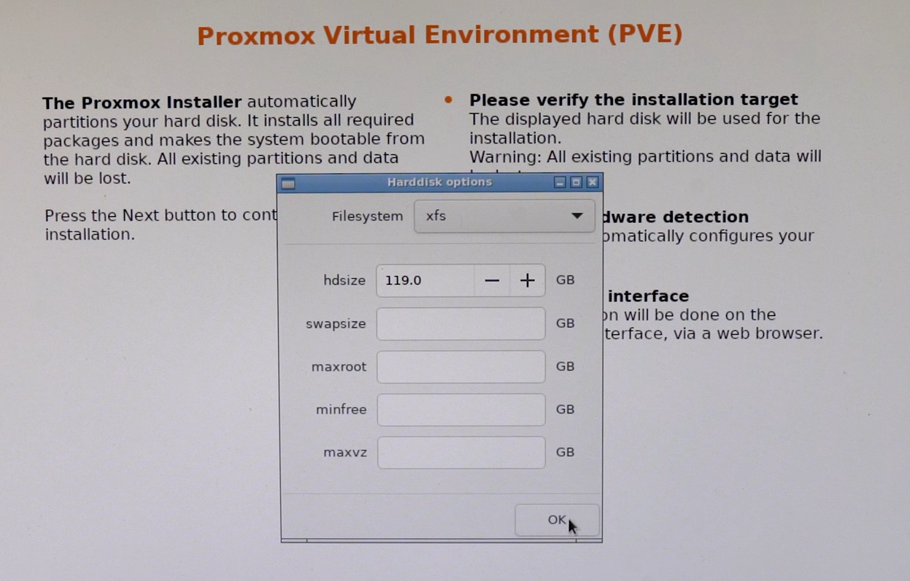

# Installation Guide: Proxmox VE via Official ISO

This installation guide documents the SOClogix-approved process for deploying **Proxmox Virtual Environment (VE)** using the official Proxmox VE ISO installer.

The ISO-based installation method is the **preferred and default approach** for new Proxmox VE deployments. It provides a streamlined, opinionated installation workflow that includes the Proxmox kernel, required packages, and an integrated setup process for storage, networking, and initial system configuration.

This guide is intended for bare-metal hosts where a clean installation is acceptable and where rapid, consistent deployment is required. It emphasizes repeatability, security, and alignment with SOClogix infrastructure standards.

The guide covers:
- Pre-installation requirements and hardware considerations  
- ISO-based installation workflow  
- Initial system configuration and validation  
- Post-installation handoff points to hardening and configuration guides  

This document assumes familiarity with Linux system administration and is designed to be used in conjunction with subsequent post-installation, security hardening, and best-practice documentation within this repository.

---

## Hardware Requirements

### Basic / Minimum
  - CPU: 64bit (Intel 64 or AMD64)
  - Intel VT/AMD-V capable CPU/motherboard for KVM full virtualization support
  - RAM: 2 GB RAM for the host OS and services, plus additional RAM needed for VMs and LXC Containers
  - Solid State Drive or Enterprise Hard Drive (10,000 RPM+)
    - At least 8 GB for the OS, with SSDs recommended for better performance.
    - One dedicated disk for Proxmox installation
  - One network card (NIC)

### Advanced / Recommended
- **CPU**
  - 64-bit (x86_64) processor
  - Hardware virtualization support enabled (Intel VT-x / AMD-V)
    - For PCI(e) passthrough a CPU with VT-d/AMD-d CPU flag is needed.
  - Recommended: CPU with AES-NI support
    - If you must use a CPU without AES-NI, be prepared for major performance limitations in security-focused applications. Without AES-NI expect: Slower Encryption, Higher CPU Load, Reduced VM Performance
    - Intel first released CPUs with AES-NI in 2010 (Westmere)
    - AMD first released CPUs with AES-NI in 2011 (Bulldozer)
    - Use software like CPU-Z or check your CPU's specifications on Intel/AMD's website.
    - On Linux, use the below command to see if the aes flag is present.
        ```
        lscpu | grep aes
        ```

- **Memory**
  - Minimum: 2 GB RAM for the host OS and services, plus additional RAM needed for VMs and LXC Containers
  - Recommended: 8 GB+ (higher for ZFS, clustering, or production workloads)

- **Storage**
  - Enterprise-grade SSDs or NVMe
    - Hardware RAID with batteries protected write cache (“BBU”)
    - or non-RAID with ZFS and SSD cache.
  - The installer will refuse to run for any drive with less than 8GB available.
  - Separate disks for:
    - OS / root (32GB / 64GB / 128GB)
    - VM storage
    - Backups 
    - ISOs and Containers
  - For ZFS:
    - non-RAID
    - ECC memory strongly recommended
    - Minimum of two disks for mirrors
  - Shared and distributed storage is also possible.

- **Networking**
  - At least one dedicated network interface
  - Recommended:
    - Multiple NICs for management, VM traffic, and storage
    - 10 GbE or higher for clustered or storage-heavy environments

---

## Pre-Installation Requirements and Tasks

### Firmware and BIOS / UEFI Configuration

Before installation, configure system firmware as follows:

- Update system BIOS / UEFI to the latest stable version
  - Unless otherwise required such as a later firmware version has known issues with Proxmox/virtualization.
- Enable:
  - CPU virtualization extensions (VT-x / AMD-V)
  - IOMMU (Intel VT-d / AMD-Vi) if PCI passthrough is planned
  - UEFI mode (preferred)
- Verify:
  - System clock accuracy
  - Boot order prioritizes installation media
- Secure Boot
  - Secure boot needs to be disabled when booting an installer prior to Proxmox VE version 8.1.
  - Since Proxmox VE 8.1, the Proxmox VE bootloader has been signed by the official secure boot certificate from Microsoft.
  - Up to kernel version 6.2.16-7, the Proxmox VE kernel was not out of the box Secure Boot friendly because it did not sign kernel modules at build time, and to get it to boot one had to manually sign all the modules with a DB key after every kernel upgrade.
  - Since version 6.2.16-8, CONFIG_MODULE_SIG is enabled at build time, which means all the modules shipped together with the kernel in the same package will be trusted by it.
  - Since Proxmox VE 8.1 and kernel 6.5.11-4, signed packages that support Secure Boot out of the box are available, replacing those shipped by Debian.

---

### Network Planning and Information Gathering

Gather and document all required network information prior to installation:

- Hostname (FQDN preferred)
- Management IP address (static)
- Subnet mask / CIDR
- Default gateway
- DNS servers
- VLAN ID (if applicable)
- NTP source (internal preferred)

> DHCP is **not recommended** for Proxmox VE management interfaces in production environments.

---

### Proxmox VE ISO
- Download the latest ISO from the Proxmox Website.  
At this time, SOClogix utilizes the Proxmox VE 8.x release and has not upgraded to Proxmox VE 9.x.  
Promox VE 8 is based on Debian 12 while Proxmox VE 9 is based on Debian 13.  
https://www.proxmox.com/en/downloads/proxmox-virtual-environment/iso

- Either prepare a USB Installer using a tool such as [rufus](https://rufus.ie/en/)
  - [Etcher](https://etcher.io/) works out of the box.
  - Rufus requires the use of DD mode to make it work.
  -  Do not use UNetbootin. It does not work with the Proxmox VE installation image.
- OR map the ISO file as ***Virtual Media*** using iDRAC.

---

## Installation

### Using the Proxmox VE Installer

#### 1. When the installer loads you will be presented with the below menu:


    This guide will utilize the Graphical installation.  
    Select 'Install Proxmox VE (Graphical)'

---

#### 2. Read and accept the EULA to continue.
    


    Graphical errors can occur in which the installer screen shows black where the EULA is.  
    In this case, the mouse and keyboard should still work allowing you to continue on.

---

#### 3. Choose the target disk to install.


    The installer creates a Volume Group (VG) called pve, and additional Logical Volumes (LVs) called root, data, and swap, if ext4 or xfs is used.

---

#### 4. Advanced LVM Configuration Options.



    hdsize
        Defines the total hard disk size to be used.  
        This way you can reserve free space on the hard disk for further partitioning (for example for an additional PV and VG on the same hard disk that can be used for LVM storage).

    swapsize
        Defines the size of the swap volume.
        The default is the size of the installed memory, minimum 4 GB and maximum 8 GB. 
        The resulting value cannot be greater than one eight of the size of the hard drive (hdsize / 8).
    
    maxroot
        Defines the maximum size of the root volume, which stores the operation system.
        With more than 48 GiB storage available, the default is a quarter of the the size of the hard drive (hdsize / 4) with a maximum of 96 GiB. 
        With less than 48 GiB of storage available, the root volume size is at least half the size of the hard drive (hdsize / 2).
    
    maxvz
        Defines the maximum size of the data volume. 
        The actual size of the data volume is:
            datasize = hdsize - rootsize - swapsize - minfree
            Where datasize cannot be bigger than maxvz.

    minfree
        Defines the amount of free space that should be left in the LVM volume group pve. 
        With more than 128GB storage available, the default is 16GB, otherwise hdsize/8 will be used.

#### Recommendations

##### Filesystem
- Unless there is a documented exception, use the default **ext4** filesystem.
- ext4 is the approved and supported filesystem for Proxmox VE host installations.

###### Rationale:
- Fast `fsck` and reliable crash recovery
- Low operational and administrative complexity
- Stable and predictable behavior across kernel updates
- Excellent small-file and metadata performance, which aligns with Proxmox host workloads

---

##### hdsize
- Unless otherwise required, allocate the **full available disk size** to the Proxmox installation.

###### Rationale:
- Simplifies disk layout and capacity planning
- Avoids future repartitioning or reinstallation
- Ensures sufficient space for logs, packages, and system growth

---

##### swapsize
- Set swap size to **0**.

###### Rationale:
- Proxmox VE hosts should not rely on swap for normal operation
- Prevents performance degradation under memory pressure
- Memory exhaustion should be addressed through capacity planning, not swapping

###### When to use Swap:
- OOM Prevention: Swap acts as a safety net, preventing the host from crashing when RAM is fully exhausted.
- Fast Storage: If you use swap, it should be on an SSD, not a slow HDD, to minimize performance impact.
- VM Swap: Enable swap within guests too, so they don't overcommit and cause host-level swapping issues. 
---

##### maxroot
- Set the root filesystem size to **32 GB, 64 GB, or 128 GB**, based on environment and expected usage.

**Guidance:**
- 32 GB: Minimal or lab environments
- 64 GB: Standard production deployments
- 128 GB: Systems with increased logging, monitoring, or tooling requirements

---

##### maxvz
- Leave this setting at the installer default.

###### Rationale:
- Default behavior aligns with Proxmox best practices
- VM and container storage is handled on secondary disks per standard design

---

##### minfree
- Leave this setting at the installer default.

###### Rationale:
- Default free-space reservation is sufficient for host OS stability
- No tuning is required when VM storage is not located on the root filesystem  

---

#### 5. Next, set the location, time zone, and keyboard layout. The installer autodetects most of these configurations.


#### Recommendations
- Ensure the Time Zone matches what is accurate for your organization, location, policy, etc.
- SOClogix typically uses the America/New_York timezone

---

#### 6. Create an admin password and type in an email address for system administrator notifications.


> This sets the password for the root user

#### Recommendations
- Set a temporary password which follows standards:
  - 14 characters minimum
  - 1 uppercase letter (A-Z)
  - 1 lowercase letter (a-z)
  - 1 number (0-9)
  - Restrict symbols to Dashes ( - ),  Periods ( . ), and Underscores ( _ )

##### Usage Constraints
###### Temporary passwords:
- Must NOT be reused across systems
- Must NOT be stored long-term
- Must NOT be shared outside the installation team  
- Must be rotated immediately after installation
- Must be replaced with a password manager–generated password

---

#### 7. The final step in installing Proxmox is setting up the network configuration. Select the management interface, a hostname for the server, an available IP address, the default gateway, and a DNS server. During the installation process, use either an IPv4 or IPv6 address. To use both, modify the configuration after installing.


---

#### 8. Let the installer complete the installation and auto-reboot after install completes.

---

## Resources
https://pve.proxmox.com/wiki/Installation  
https://pve.proxmox.com/pve-docs/chapter-pve-installation.html  
https://pve.proxmox.com/wiki/System_Requirements  
https://www.proxmox.com/en/products/proxmox-virtual-environment/requirements  
https://pve.proxmox.com/pve-docs/pve-admin-guide.html#_system_requirements  
https://pve.proxmox.com/wiki/Secure_Boot_Setup  
https://pve.proxmox.com/wiki/Prepare_Installation_Media#installation_prepare_media  
